<div align="center">


# CPS 会员联运清结算平台

**多品牌 · 开放代理 · 混合资金 · SaaS 化** 的会员联运分发与清结算全栈平台
*业务层在上，投流 SaaS 底座在下 —— 把单品牌 CPS 投流做成可联运、可结算、可风控的平台。*

[产品预览](#-产品预览) · [三类入口](#-三类入口一套底座) · [核心模块](#-核心模块) · [快速开始](#-快速开始) · [安全与质量](#-安全与质量review) · [技术栈](#-技术栈) · [版本记录](#-版本记录) · [商业化边界](#-商业化就绪边界)

<br/>


</div>

---

## 📊 产品预览

> 截图为演示模式实机截取（同一套 UI 直连真实 NestJS 后端即为生产形态）；数据为演示种子，金额为结构示意。

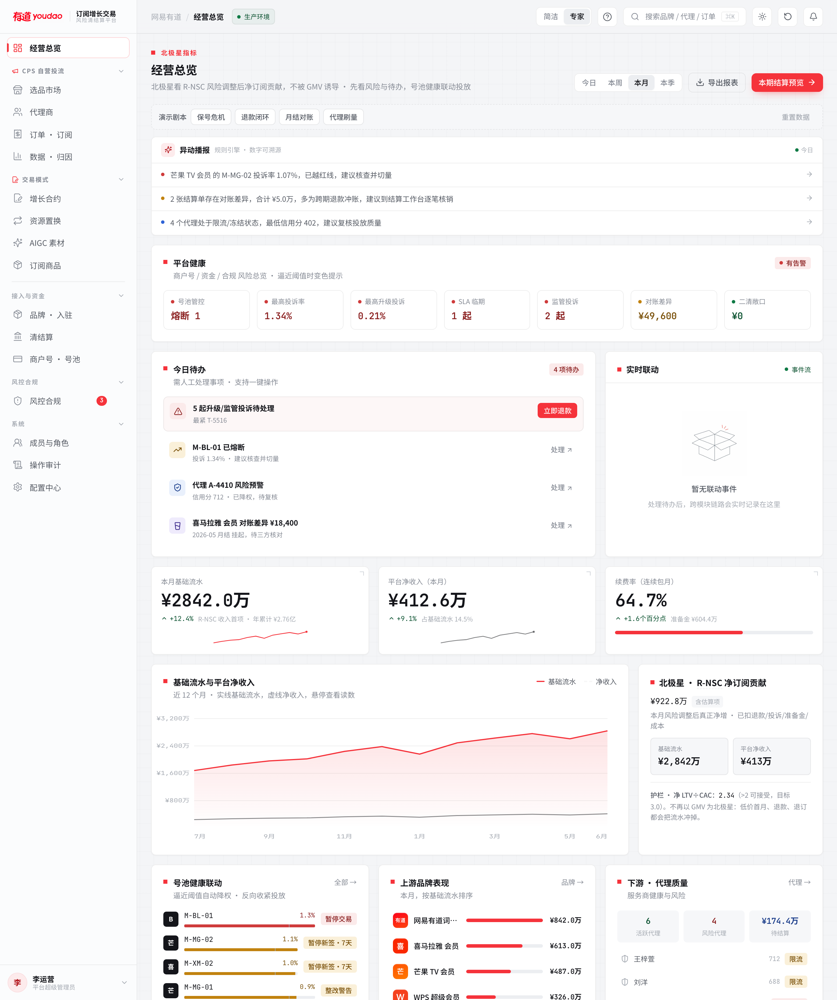

<div align="center"><sub>经营总览 —— 北极星 R-NSC · 平台健康风险条 · 今日待办行动中心 · 号池/品牌/代理三层联动</sub></div>

<br/>

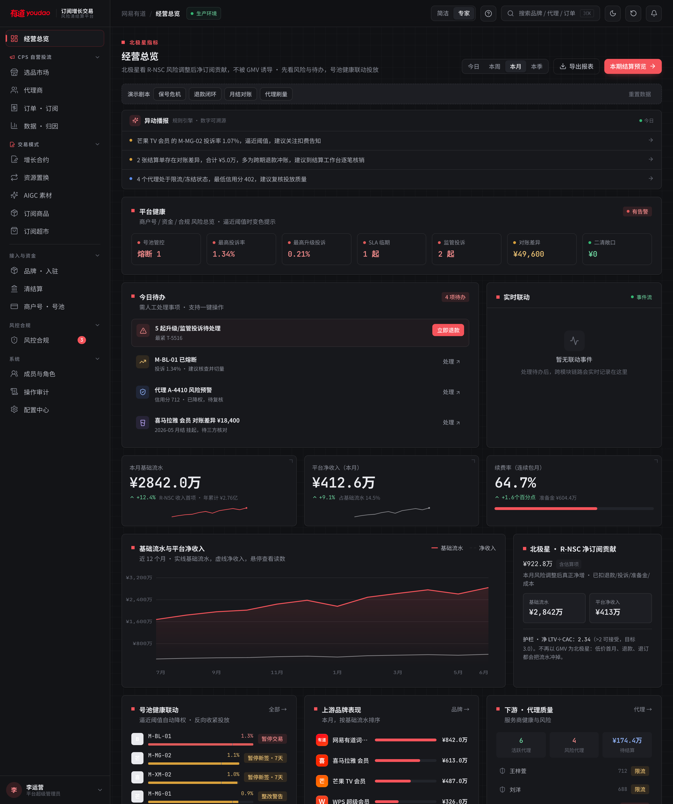

<div align="center"><sub>暗色主题 —— 令牌级三态换肤（明亮 / 暗色 / 跟随系统），全站零组件改动整体适配</sub></div>

<br/>

| 登录 · 品牌叙事分栏 | C 端订阅超市 · 组合算价 |
|:---:|:---:|
| 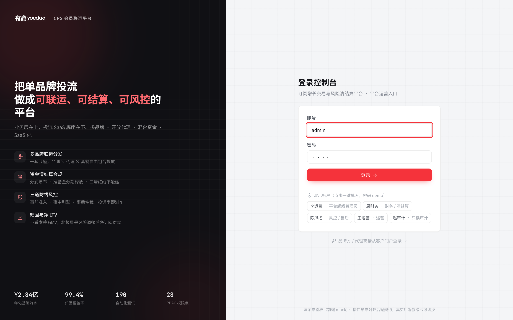 | 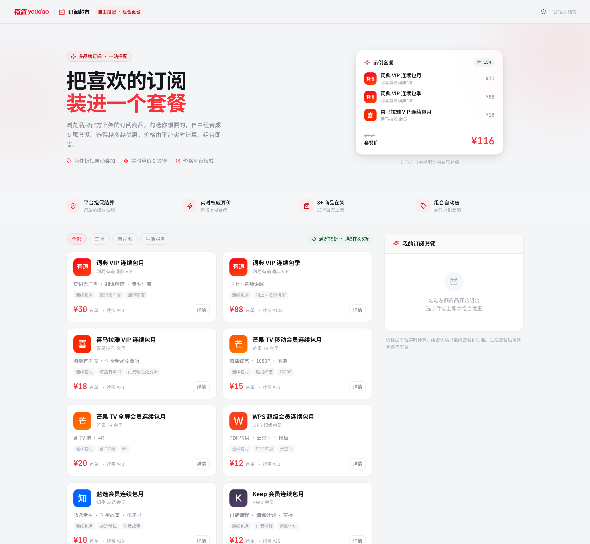 |
| **清结算 · 分润瀑布 / 双路径** | **商户号 · 号池健康状态机** |
| 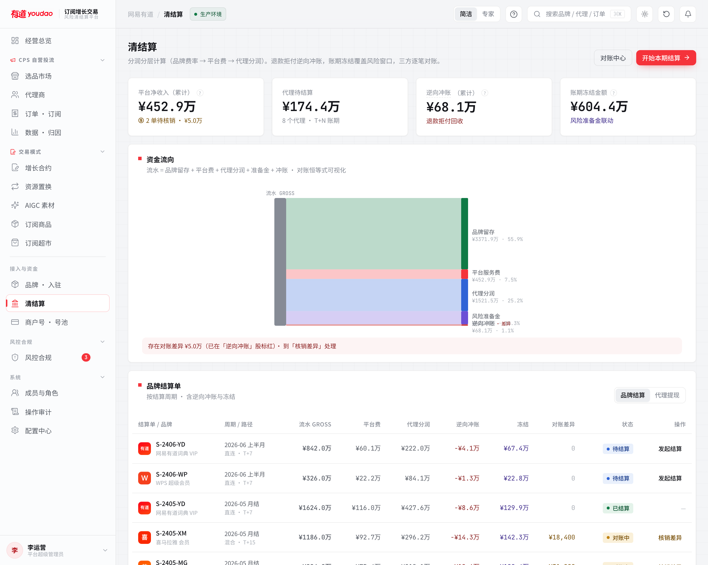 | 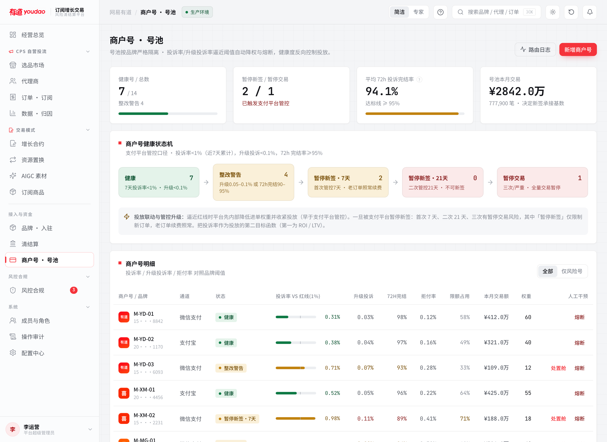 |
| **品牌方门户 · 我的经营** | **代理商门户 · 我的投放** |
| 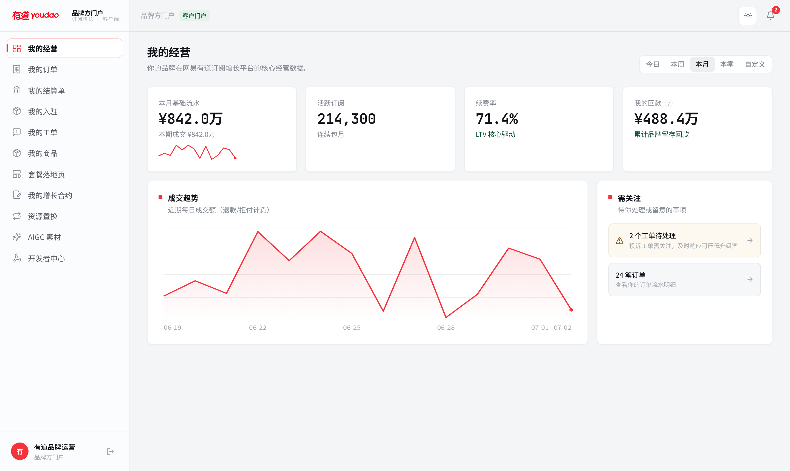 | 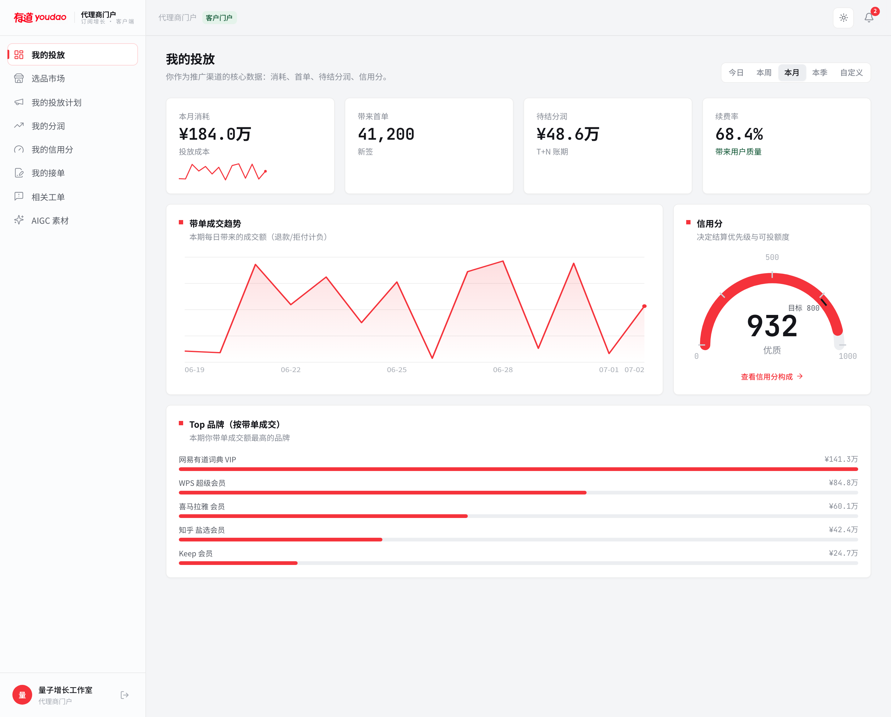 |
| **风控中心 · 三道防线** | **数据 · 归因 / R-NSC 分解** |
| 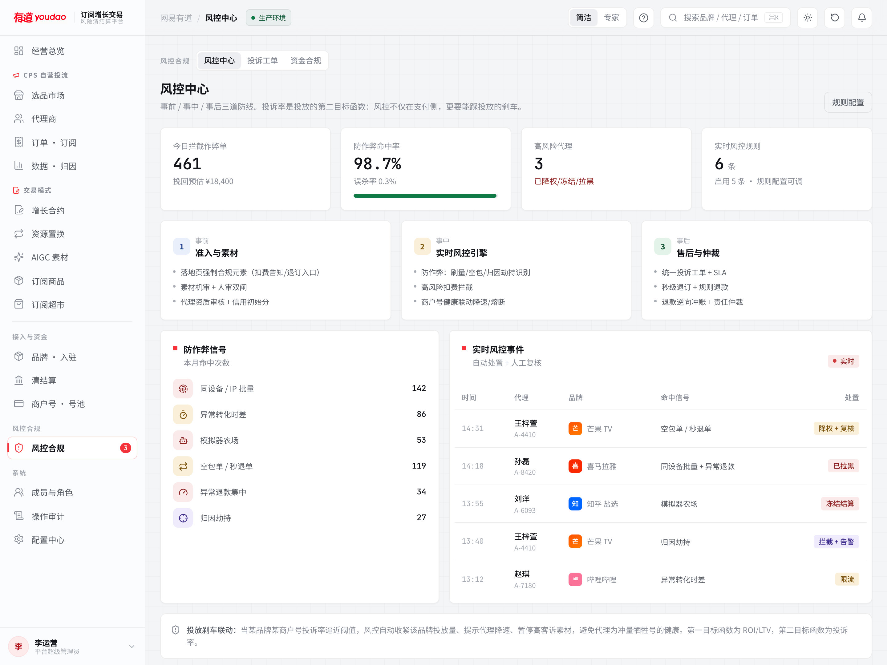 | 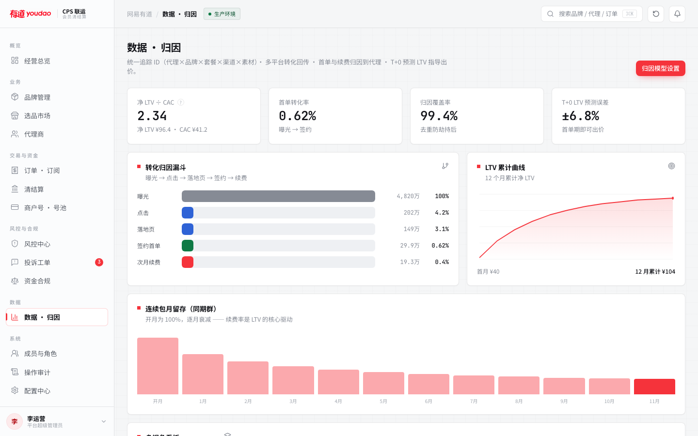 |
| **成员与角色 · RBAC 矩阵** | **操作审计 · append-only 留痕** |
| 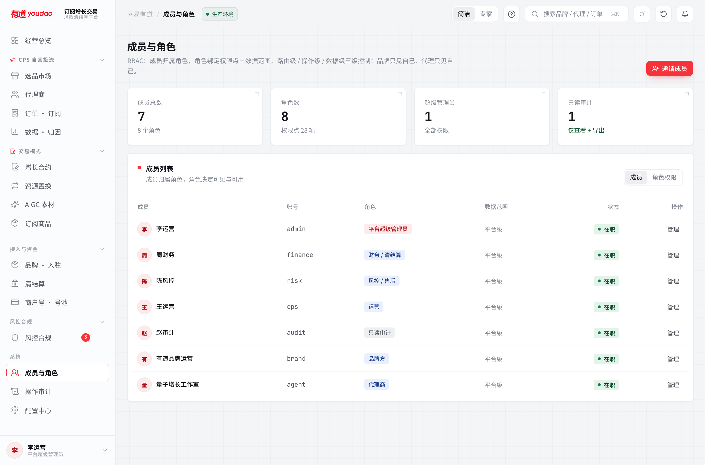 | 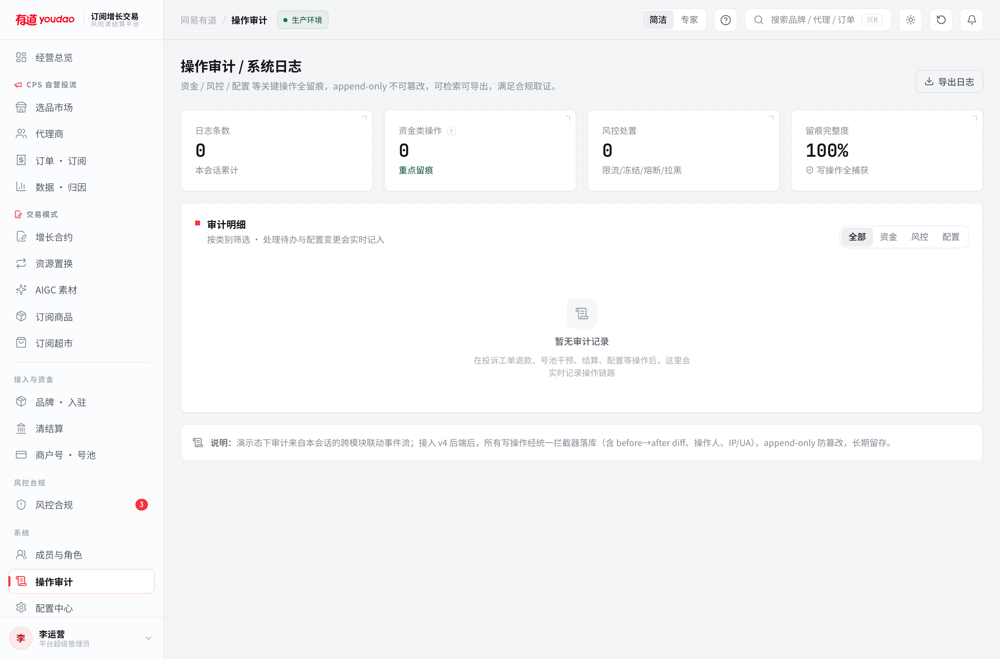 |

---

## 🚪 三类入口，一套底座

| 入口 | 路由 | 面向 | 能力 |
|---|---|---|---|
| **内部控制台** | `#/login` → `#/` | 平台运营（5 种角色） | 19 个业务页：总览/品牌/代理/订单/清结算/号池/风控合规/归因/RBAC/审计/配置… |
| **客户门户** | `#/portal/login` | 品牌方 / 代理商 | 品牌 11 页（经营/订单/结算/工单/商品/落地页/合约/置换/开发者中心），代理 8 页（投放/选品/分润/信用分/接单/提现） |
| **C 端订阅超市** | `#/market` | 终端用户（免登录） | 多品牌商品自由组合 · 互斥校验 · 满件折扣实时算价 · 成套支付 → 运营受理拆单履约 |

三个入口共享同一套设计系统与数据底座；数据级 RBAC 保证品牌只见自己、代理只见自己。**演示模式（无后端）三个入口全部可完整体验**：控制台走本地种子 store，门户走按租户合成的 `portalDemo` 数据层，超市走与服务端同口径的本地货架与算价。

---

## 🧩 核心模块

内部控制台 19 页 + 品牌门户 11 页 + 代理门户 8 页 + C 端超市，后端 **106 个 API**。真实模式读取走服务端，写操作镜像服务端并以服务端为审计权威源。

| 模块 | 路由 | 核心能力 |
|---|---|---|
| 经营总览 | `/` | 北极星 R-NSC（风险调整后净订阅贡献）· 简洁/专家双视图 · 平台健康风险条 · 今日待办 · 实时联动事件流 |
| 品牌管理 | `/brands` `/brands/:id` | **配置驱动接入**：费率/套餐/通道/商户号/阈值/结算规则全参数化；专属号池；LTV 曲线 |
| 选品市场 | `/marketplace` | 面向代理的可投套餐 · 透明费率（分润随配置中心联动）· 一键领取追踪链接 |
| 代理商 | `/agents` | 自助入驻 KYC 门禁 · 信用分联动与排序 · 投诉/退款 · 黑名单 · 分层准入 · 灵活用工开票 |
| 订单 · 订阅 | `/orders` | 首单/续费/退款/拒付全生命周期 · KPI 由订单流真值派生 · 防重复退款（跨路径同锚） |
| 增长合约 | `/contracts` | 品牌发单 ↔ 渠道接单 · CPS 分成 / 保底+阶梯 / 互销额度三种结算模型 · 履约进度 |
| 资源置换 | `/barter` | 品牌间流量/权益互换台账 · 双边确认 · 开票状态 |
| AIGC 素材 | `/aigc` | 积分制生成投放素材 · 素材→投放→转化回流按 LTV 排名 |
| 订阅商品 / 超市 | `/products` `/supermarket` | 品牌上架 → 平台审核 → C 端组合购买 → 受理拆单履约（服务端权威分摊） |
| 清结算 | `/settlement` | **分润瀑布** · 逆向冲账 · 准备金分期释放（守恒式 II）· 三方对账 · 代理提现 · 直连/持牌分账双路径 |
| 商户号 · 号池 | `/merchants` | **健康状态机** · 智能进单路由 · 阈值熔断 · 号池隔离 · 投放联动 · mid 脱敏 |
| 风控合规 | `/risk` `/complaints` `/compliance` | 三页合一工作台：三道防线 · 多源投诉分级 SLA（超时可见）· 二清红线对照 |
| 数据 · 归因 | `/analytics` | R-NSC 构成分解 · 转化归因漏斗 · LTV 曲线 · 留存同期群 · 代理/品牌/渠道多视角 |
| 成员与角色 | `/members` | RBAC：28 权限点 · 8 角色 · 角色×权限矩阵 · 数据范围 scope |
| 操作审计 | `/audit` | 资金/风控/配置全留痕 · append-only · 可检索导出 |
| 配置中心 | `/settings` | 平台参数 · 风控阈值 · 持牌分账通道 · 数据隔离（与服务端 Config 表双向同步） |
| 品牌开发者中心 | `/portal/brand/developer` | RSA 密钥自助生成/上传 · 回调地址 · webhook 投递日志 · 签名调试台 · 就绪度体检 |
| 有道 CPS 对接 | `POST /pay/outside/order` 等 | 连续包月「先签约后代扣」全生命周期（RSA 签名 · 幂等 · 补扣队列 · 状态回调），见 [`docs/cps-连续包月对接规范.md`](docs/cps-连续包月对接规范.md) |

**核心联动（服务端事务）**：工单退款 → 逆向冲账（冲减代理分润）→ 代理待结算↓/信用分↓/可能限流 → 准备金逆向追偿 → 写审计。失败整笔回滚；同一原单跨路径（订单退款/工单退款/CPS 退款）**至多退一次**（应用层同锚 + DB 唯一约束双保险）。

---

## 🚀 快速开始

仓库是**全栈单体**：`src/`（前端 Vite+React）+ `server/`（后端 NestJS+Prisma）。

### 纯前端演示模式（零依赖，30 秒起）

```bash
npm install
npm run dev            # → http://localhost:5273（localStorage 种子数据，三入口全可用）
```

### 全栈真实模式（双进程）

```bash
# 1) 后端（终端 1）
cd server
npm install
npx prisma db push          # 建表（SQLite，零依赖）
npm run seed                # 灌演示数据（9 账户/角色/品牌/代理/号池/商品/凭证…）
npm run start:dev           # http://localhost:3001 · Swagger 文档 /docs

# 2) 前端（终端 2）
npm run dev:real            # 真实后端模式 → http://localhost:5273
```

### 演示账户（密码一律 `demo`）

| 入口 | 账号 | 角色 / 数据范围 |
|---|---|---|
| 控制台 `#/login` | `admin` | 平台超级管理员（全部权限） |
| 控制台 | `finance` / `risk` / `ops` / `audit` | 财务清结算 / 风控售后 / 运营 / 只读审计（体验 RBAC 收窄） |
| 客户门户 `#/portal/login` | `brand` | 品牌方 · 只见网易有道的数据 |
| 客户门户 | `agent` | 代理商 · 只见 A-2041 量子增长工作室的数据 |
| 订阅超市 `#/market` | — | 免登录直接逛 |

顶栏可切换 **简洁/专家** 双视图与 **明亮/暗色/跟随系统** 三态主题；`⌘K` 全局搜索品牌/代理/订单。

### Docker 一键起（需本机装 Docker）

```bash
docker compose up --build              # → http://localhost:8080（SQLite）
# 生产 PostgreSQL：
docker compose -f docker-compose.yml -f docker-compose.pg.yml up --build
```

---

## 🔐 安全与质量（Review）

经过**五轮对抗式安全自审**（含独立子代理三路并行审计），累计定位并修复 **60+ 个真实缺陷** —— 每个都「可复现 → 修复 → 加测试 → 实跑验证」。

**第五轮（v8）**：

| 严重度 | 缺陷 | 修复 |
|---|---|---|
| 🔴 严重 | 工单退款缺跨路径去重锚 → 同一原单沿 `order.refund → ticket.refund` **双倍冲账、双扣代理** | 事务内补 `refundedOrderId` 锚检查 + DB 唯一约束兜底并发 |
| 🔴 严重 | 幂等键未绑定资源：同一 `Idempotency-Key` 复用到另一笔订单 → **静默回放首单结果，第二笔"看似退款成功实际没退"** | 幂等键绑定目标资源/租户（`bind` 参数），异资源各自执行 |
| 🟠 高 | CPS 签约不校验商品归属：品牌 A 凭证可签约品牌 B 商品 → GMV/结算跨品牌错记 | 商品查询强制 `brandId` 归属匹配 |
| 🟠 高 | 前端平台配置写被服务端白名单静默过滤为 0 项却返回 `ok:true`（配置只活在本地） | 白名单补 5 个复合键 + 0 项保存返回 `ok:false` |
| 🟠 高 | 多标签页/StrictMode 并发 refresh 触发旋转令牌重放检测 → **全会话族被吊销（随机登出）** | 启动 once-promise 去重 + Web Locks 跨标签页串行化 |
| 🟠 高 | 内部路由仅导航隐藏、无权限也可直链进入并操作（mock 态真实生效） | `RequirePerm` 路由守卫 + 无权限工作台空态 |
| 🟡 中 | 真实模式登出不清水合数据（共享机器泄漏给下一登录者）；演示/真实共用持久化键互相污染 | 登出清场 + 按模式分键 + 演示键升 v3 |
| 🟡 中 | 演示登录任意账号静默回退成超管；工单升级 `level` 不落库被水合冲掉；北极星 R-NSC 与数据页相差 ¥960 万 | 未知账号拒绝 / level 全链路持久化 / 单一数据源 |
| 🟢 低 | 详情气泡内滚动即关闭 · Confirm 可双击双发 · 图表单点 NaN/负值裁剪/目标标签重叠 · 弹窗无焦点陷阱 等 20+ 项 | 逐项修复（详见提交记录） |

<details>
<summary><b>历史四轮修复摘要</b>（资金双花 / 提权链 / 越权泄漏 / 令牌盗用等 24 项，点击展开）</summary>

| 严重度 | 缺陷 | 修复 |
|---|---|---|
| 🔴 严重 | 幂等服务并发输家重执行 + 占位毒化 → **资金双花** | 轮询等待赢家结果 + 失败删占位；条件更新防并发 |
| 🔴 严重 | `member.manage` 可自我提权到 `super` | 角色/成员角色变更收紧为 super 专属 + 禁自我编辑 |
| 🔴 严重 | 数据级 RBAC scope 失配**默认放行**越权泄漏 | 改默认拒绝（DENY 不可能匹配条件） |
| 🟠 高 | refresh 重放检测无遏制（攻击者持新令牌） | 检测到重用 → 吊销该用户全会话族 |
| 🟠 高 | 资金配置无界（feeRate 可负/超界） | DTO 全字段 `@Min/@Max` + `forbidNonWhitelisted` |
| 🟠 高 | Prisma 错误未映射（不存在 id → 500） | 过滤器映射 P2025→404 / P2002→409 / P2003→400 |
| 🟠 高 | ID `Date.now().slice` 同毫秒碰撞 → 事务内 500 | 改 `randomUUID` 短码 |
| 🟡 中 | access token 登出后仍有效 15min | `User.tokenVersion` 嵌入 JWT，登出/改角色即失效 |
| 🟡 中 | 资金审计 fail-open（可静默丢失） | 资金动作审计移入业务事务（fail-closed）+ 旁路落盘 |
| 🟡 中 | `switchRole` 真实模式可前端伪造 super | real 模式 no-op + 菜单仅 mock 渲染 |
| 🟡 中 | 创建实体并发 hydrate 丢失 / `useApi` 参数脚枪 / `seq` 发号碰撞 | 重新插入兜底 / 改签名 / 扫全实体 id |
| 🟡 中 | mirror 写失败静默 + UI/服务端分歧 | 失败提示 toast + 重新 hydrate 回收真值 |
| 🟢 低 | JWT 未 pin 算法 / X-Request-Id 响应头注入 / 空角色 500 | `algorithms:['HS256']` / 入站清洗限长 / 空值保护 |

</details>

**纵深防护**：登录限流（10/min 防爆破）· Helmet 安全头 · 生产密钥强校验 · 依赖漏洞扫描（`npm audit` 接 CI，逐条研判见 [`server/SECURITY-AUDIT.md`](server/SECURITY-AUDIT.md)）· PII 脱敏（手机号/商户号）· 审计旁路落盘。

**测试矩阵**：后端 146（e2e + 单测）· 前端 35（Vitest+jsdom）· 端到端 9（Playwright 真实浏览器，覆盖权限守卫/超市闭环/门户登录）· **共 190 自动化用例**。CI 五作业：前端构建 / 后端 e2e / PG schema 校验 / Playwright / 依赖扫描。

---

## ⚙️ 技术栈

| 层级 | 技术 |
|---|---|
| 前端 | Vite 6 · React 19 · TypeScript(strict) · Tailwind v4 · react-router 7 · 自研 SVG 图表（无图表库） |
| 主题 | 设计令牌单一来源（`@theme`）· `data-theme` 暗色整套覆盖 · 跟随系统实时切换 · `prefers-reduced-motion` 全链路尊重 |
| 后端 | NestJS 11 · Prisma 6 · argon2 · JWT(access) + httpOnly 刷新令牌 · class-validator · pino · Swagger/OpenAPI |
| 数据库 | SQLite（本地零依赖）/ PostgreSQL（生产，双 schema 同步 + CI 校验） |
| 可观测 | prom-client（HTTP 延迟直方图 P50/95/99 + 业务指标）· 请求追踪 ID · `/health` `/ready` 探针 |
| 鉴权/RBAC | argon2 哈希 · JWT + tokenVersion 即时失效 · 28 权限点 · 路由/操作/数据三级守卫 · 默认拒绝 |
| 资金安全 | 幂等键资源绑定(防双花/防吞单) · 跨路径退款唯一锚 · 条件更新(防并发) · 审计 fail-closed(同事务) · 每日对账任务（恒等式 I + 守恒式 II/III/IV） |
| 对外开放 | 有道规范 RSA(SHA256) 签名 · 时间戳防重放 · 凭证自助管理 · webhook 投递与重试日志 |
| 工程化 | 双 schema 同步校验 · 优雅停机 · 软删除 · 游标分页 · 截图流水线（`scripts/screenshots.mjs`）· GitHub Actions CI |

---

## 🗂 后端 API（106 端点 · 详见 `/docs` 与 `server/openapi.json`）

| 域 | 代表端点 |
|---|---|
| 鉴权 | `POST /auth/login` `/refresh` `/logout` · `GET /auth/me` |
| RBAC | `GET /permissions /roles /members` · `PATCH /roles/:id /members/:id` |
| 业务读 | `GET /brands /agents /merchants /orders(游标分页) /settlements /tickets /summary /config /reserve-releases /subscriptions` |
| 资金写 | `POST /settlements/:id/clear /reconcile` · `/tickets/:id/refund` · `/orders/:id/refund` · `/agents/:id/settle` · `/reserve/:id/release /freeze` · `/reserve/release-due`（全部幂等 + 审计 fail-closed） |
| 业务写 | `/merchants/:id/state` · `/agents/:id/status` · `/brands`(创建/配置/软删) · `/contracts`(发单/接单/推进) · `/barter`(发起/响应) · `/products/:id/review` · `/bundles/:id/fulfill`(拆单履约) · `/complaints/ingest` `/fulfillment/ingest`(可信中继) |
| C 端超市 | `GET /market/products /rules` · `POST /market/quote /bundle /bundle/:id/pay`（服务端权威算价） |
| 客户门户 | `/portal/summary` + 品牌 15 端点（订单/结算/工单/商品/合约/置换/开发者中心）+ 代理 12 端点（投放/分润/信用分/接单/提现）+ 通知 |
| 有道 CPS 对接 | `POST /pay/outside/order` · `/order/outside/refund /unsign` · `GET /order/outside/orderQuery`（RSA 验签 + 幂等）+ 内部 sim 触发 |
| 对账/可观测 | `POST /reconciliation/run` · `GET /health /ready /metrics` |

---

## 📁 目录

```
cps-platform/
├── src/                       前端（Vite + React + TS）
│   ├── lib/                   store(状态+水合+镜像) · auth · http · adminApi/portalApi/marketApi
│   │                          └─ portalDemo/marketDemo（演示模式按租户合成数据层）
│   ├── components/ui/         设计系统原语 + 自研 SVG 图表 + 弹层（焦点陷阱/防误关）
│   ├── components/layout/     侧边栏 / 顶栏(主题切换) / AuthShell(登录叙事分栏) / 命令面板
│   ├── components/portal/     客户门户公共套件（资源状态机/骨架/CSV）
│   └── pages/                 控制台 19 页 · portal/ 门户 · market/ 订阅超市 · workspaces/ 合并工作台
├── server/                    后端（NestJS + Prisma）
│   ├── src/auth src/rbac      鉴权 · JWT+刷新令牌 · 28 权限点三级守卫
│   ├── src/business/          业务控制器 · 结算/对账/履约/准备金释放领域服务 · scope 收敛
│   ├── src/cps src/youdao     连续包月生命周期 · 有道规范 RSA 对接 · webhook 投递
│   ├── src/market src/portal  C 端超市（权威算价）· 客户门户 scoped 端点
│   ├── src/common/            金额精度(decimal) · 幂等(资源绑定) · 指标 · 异常映射 · 健康
│   └── prisma/                schema(sqlite) + schema.postgres(同步校验) + seed
├── e2e/                       Playwright 端到端（9 用例）
├── scripts/screenshots.mjs    README 产品截图流水线
├── docker-compose.yml         一键起（+ .pg.yml 生产 PostgreSQL）
└── docs/                      对接规范 · 规划文档归档 · 截图
```

---

## 📜 版本记录

| 阶段 | 内容 |
|---|---|
| **v8 · 全面审查 + 体验升级** | 三路对抗式审查修 40+ 缺陷（工单退款跨路径双冲账 P0 / 幂等键资源绑定 / CPS 跨品牌签约 / 配置契约漂移 / 刷新令牌互踢 / 权限路由守卫）；**暗色模式**（令牌级三态主题）；登录页品牌叙事重设计；**演示模式全入口打通**（订阅超市本地货架算价 + 品牌/代理门户演示数据层 + 门户演示账户）；图表健壮性（单点/负值/标签防重叠）；焦点陷阱与无障碍；README 截图流水线 |
| **v7 · 前端审计 + v6 收尾** | 前端首轮对抗式审计修 4 缺陷（switchRole 伪造 super / 创建并发丢失 / useApi 脚枪 / seq 碰撞）；X-Request-Id 入站清洗；创建写以服务端 id 为准 |
| **v6 · 运维成熟度** | 批次A 可观测性（请求追踪 ID + prom-client + 健康升级 + 优雅停机）；批次B 唯一约束 + 对账任务；批次C 审计旁路 + 依赖扫描 + PII 脱敏 |
| **v5 · 纵深防御** | access token 即时失效（tokenVersion）；JWT 算法 pin；资金审计 fail-closed；refresh 重放吊销全族；输入校验补全；Prisma 错误映射 4xx |
| **v4 · 安全自审 ×2** | 修复资金双花、提权链、越权泄漏、令牌盗用等 11+8 个真实缺陷 |
| **v3 · 全栈打通** | 真后端（NestJS+Prisma+SQLite）；前端双模式接真 API；PostgreSQL 生产路径；Docker 一键起；CI；前端单测 + Playwright |
| **v2 · 账户/RBAC/后台** | 登录/鉴权/RBAC（演示态对齐契约）；成员与角色矩阵；操作审计 |
| **v1 · 可演示闭环** | 16 页业务 UI（精密仪表风格）；mock store + 事件总线；退款→冲账→信用分核心联动 |

> 提交粒度详见 `git log`：35+ 次提交，从单品牌 L2 演示闭环逐步演进到接近商用形态的全栈底座。

---

## 🚧 商业化就绪边界

工程层面已尽（真后端打通、资金幂等并发审计、数据级 RBAC、可观测、依赖扫描、190 测试 + CI），但**真正「商业可用」仍有不可由代码替代的线下必办项** —— 详见 [`商业化就绪清单-v5.md`](docs/planning/商业化就绪清单-v5.md)：

- 🔴 **持牌分账 / 支付通道签约**（连连/汇付/银行存管）—— 平台不碰资金本体（二清红线）
- 🔴 **ICP 经营许可 · 等保 2.0 · 资金合规法律意见书**
- 🟠 **真实风控数据源**（黑猫/12315/设备指纹/支付风控回传）
- 🟠 **生产部署与安全审计**（域名/HTTPS/WAF/密钥管理/渗透）

> 红线：刷单 / 虚假交易绝不实现 —— 违反《电子商务法》第十七条、《反不正当竞争法》第八条，且规避支付平台风控。合规页 `/compliance` 已将其列入「绝不能做」。

---

## 📚 规划文档

**下一轮路线图**：[`v9-execution-plan.md`](docs/planning/v9-execution-plan.md) —— 执行级方案：复杂度治理铁律（小白测试/复杂度预算）· B0 先做减法（导航 19→6/今天三件事/术语人话化）· 动线化（结算工作台/处置舱/行动队列/⌘K 动作化）· 实时化（SSE 事件通道/风控页去静态化）· 智能化（对账解释器/异动播报/Ask 模板制），每项含原因、想法、小白形态、文件级落点与验收标准。

历史产品/技术规划文档已归档至 [`docs/planning/`](docs/planning/)：产品升级计划 v2 · 优化升级计划 v3 · 后端技术方案 v4 · 商业化就绪清单 v5 · 下一轮升级规划 v6。对外接口规范见 [`docs/cps-连续包月对接规范.md`](docs/cps-连续包月对接规范.md)。

---

<div align="center"><sub>仅供学习与方案演示 · 无真实支付 / 商户号 / 用户数据</sub></div>
