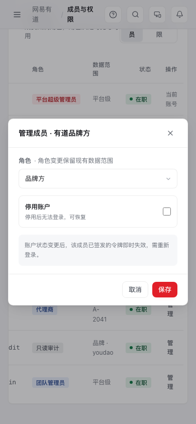
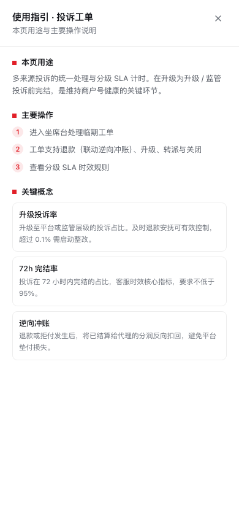

# CPS 主仓更新与验证记录（2026-10-03）

## 仓库与版本范围

本次只处理 `leoyb1010/cps-platform`。本机为 `LeoyuandeMacBook-Pro-2.local`，正式仓库是 `/Users/leoyuan/cps-platform`；任务工作区 `/Users/leoyuan/Documents/Leo-CPS平台 2` 是独立的空仓库。本次验证使用 `/Users/leoyuan/cps-platform-validation-20261003` 的隔离检出，保留正式仓库的 `.claude/launch.json` 修改及未跟踪提案、脚本和 ZIP。

- 原本地主仓：`48851fcdcf5704430fa6b335f912b407631fe081`。
- 刷新后远端 main：`08330b56334e6c7ecfb9e0adca3df9e44811846d`，较本地增加 8 个提交。
- 新分支：`codex/audit-cps-platform-20261001`，验证起点 `08e25ca62e82b372d18de1c3d99cf002b68df935`，较远端 main 增加 10 个提交。
- 主仓更新采用保留历史的 fast-forward，包含以上更新及本次补充修复。

扫描采用有界源码审查、依赖审计与实际运行验证。独立审查覆盖后端/Studio 服务端，以及前端/Studio UI/端到端测试/CI，重点核查会话代际、租户范围、积分事务、失败恢复与渲染出站边界。

## 本次补充修复

1. `role-journeys` 和 `studio` 原来仅在审计分支运行。移除分支专属条件，使它们持续覆盖 main push 和面向 main 的 PR。
2. 手机滚动后打开成员弹窗，正常入场动画的最终 transform 使页面成为 fixed 定位的包含块与层叠上下文。弹窗虽有较高 z-index，仍受页面边界限制。共享 Modal/Drawer 通过 React portal 挂在 `document.body`，保留 React context、焦点行为、关闭回调与原有样式。
3. 使用指引抽屉的 460px 固定宽度超出 390px 手机视口。增加 `maxWidth: 100%`，保留桌面宽度。
4. AIGC 组件测试改为查询实际 document 中的表单和弹窗，兼容 portal；React root 卸载继续清理测试内容。
5. README 增加最新验证范围、版本阶段与迁移说明；保留本次实际手机截图。

复现测试在修复前真实失败：成员弹窗外层 y 为 **-410px**，而不是视口起点；使用指引抽屉 x 为 **-70px**，左侧超出视口。修复后测试要求标题实际命中属于当前对话框、定位覆盖视口、手机抽屉宽度不超出 390px，并验证关闭操作。

## 验证结果

| 门禁 | 结果 | 运行边界 |
|---|---|---|
| 前端 Vitest | 83/83 通过 | 包含会话、缓存、积分与实际 React 组件渲染 |
| 后端 Vitest | 276/276 通过 | 独立临时 SQLite、真实 Nest HTTP、迁移回填与资金/权限边界 |
| Studio Vitest | 86/86 通过 | 包含真实 Chromium/FFmpeg 视频与 localhost 出站 canary |
| 普通 Playwright | 18/18 通过 | 演示模式业务流程、关键路由、响应式及正常动效抽屉 |
| 真实 API Playwright | 18/18 通过 | 9 个种子账号、跨区拒绝、跨账号会话、登出竞态、AIGC 引擎边界 fixture、正常动效成员弹窗 |
| Studio UI 脚本 | 通过 | 1440/1024/390px、表单尺寸、空输入、忙状态、注入 503、实际本地重试与错误反馈 |
| 构建/静态检查 | 通过 | 三套生产构建、前端 lint/typecheck、双 schema 同步、PG schema 校验、本次 diff 格式检查 |
| 三套 npm audit | 0 个已知漏洞 | 按项目 CI 的 high/moderate/low 阈值执行 |

上述测试合计 **481 项**，Studio UI 脚本另计。后端与 Studio 在本次共享界面修复后代码未变，复测只覆盖受影响的前端套件、浏览器流程及构建。

主要命令：

```sh
npm test
npm run lint
npm run build
npx tsc -p tsconfig.app.json --noEmit
npm run test:e2e
npx playwright test --config playwright.roles.config.ts
cd server
npx prisma generate
sh scripts/check-schema-sync.sh
DATABASE_URL=postgresql://u:p@localhost:5432/db npx prisma validate --schema prisma/schema.postgres.prisma
NODE_ENV=test NODE_OPTIONS=--require=/Users/leoyuan/cps-platform-validation-20261003/scripts/test-offline.cjs npm test
npm run build
cd ../services/agent-studio
NODE_ENV=test NODE_OPTIONS=--require=/Users/leoyuan/cps-platform-validation-20261003/scripts/test-offline.cjs npm test -- --maxWorkers=1
npm run build
node scripts/audit-ui.mjs
```

本机 Prisma 建立临时角色测试库时需 `RUST_LOG=info`；已有测试库助手使用相同设置。Studio 第一次本机全套运行因缺少对应版本 Chromium 失败 2 项，安装项目 Playwright 的 Chromium 后完整 86 项通过，未跳过这两项。

分支起点的 [GitHub CI 37081439188](https://github.com/leoyb1010/cps-platform/actions/runs/37081439188) 已确认 9/9 job 成功，包括 Docker/PostgreSQL 运行时。其实际截图已下载并查看。本次补充修复由 main push 的同一组 9 项 CI 再验证，可从 [仓库 Actions](https://github.com/leoyb1010/cps-platform/actions) 查看本记录提交对应结果。

## 实际截图

两张截图来自一次性测试账号和本机真实 Chromium，已实际查看；这里使用手机视口截图，以检查用户实际可见区域。





其他验证截图位于本机 `/tmp/cps-ui-audit`、`/tmp/cps-role-ui-audit`、`/tmp/cps-validation-20261003-studio-screens`；远端 CI 也保存角色与 Studio 截图工件。

## 生产发布要求与范围限制

此次操作更新代码、依赖与本地构建，并同步 GitHub main。生产服务发布、线上数据库操作和客户真实交易属于后续部署步骤。

生产发布本分支前应备份核心和 Studio 数据库，排空在途 Studio 生成任务，检查既有预留积分，应用 SQLite/PostgreSQL 各自的 `6_refresh_token_generation` 增量迁移，再切换新版服务。该迁移新增 `RefreshToken.tokenVersion` 并从用户代际回填。回滚源码不能通过删除迁移列或账本数据完成。

实际验证未覆盖真实支付/短信/模型供应商、线上压力与真实生产恢复。内置 Chromium 渲染的出站 canary 结果仅适用于该后端；可选 Hyperframes producer 是另一条既有路径，需要单独的进程和出站隔离。

两项可选后续问题记录：Studio 自身的旧估算请求尚未使用表单修订隔离；新增 `AGENT_STUDIO_EXPORTS_DIR` 当前适用于测试输出隔离，生产预览/下载仍使用默认静态导出目录，配置自定义目录前需统一 URL 映射。默认部署路径不受后一项影响。
