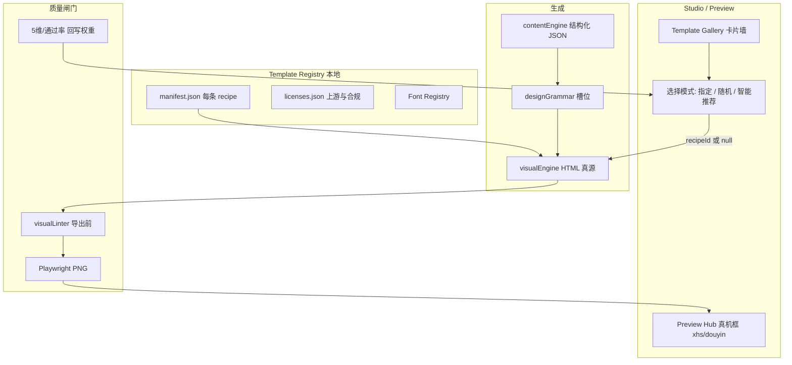

# Agent Studio Content OS · 主计划 v0.7

## 九仓评估 × 模板注册表 × 手选/随机 × 真机框 × 视觉质量闸门

> **基线**：v0.5.0 止血已完成（路由、Preview Hub、exports、测试绿）  
> **你的诉求**：把列出的 9 个 GitHub 项目变成「可选模板库」；**选了用手选，不选则随机**；输出更高级、少字体/排版/填充错误；**保留并强化真机框预览**  
> **日期**：2026-06-02  

---

## 0. 结论先说（能否「全部吸收」）

**不能、也不应该把 9 个仓库原样整包塞进产品。**

它们不是同一类东西：

| 类型 | 代表仓库 | 正确做法 |
|------|----------|----------|
| **视觉模板 / 版式语法** | Open Design、Guizang、HTML Anything、花叔、宝玉 XHS、html-ppt、乔木 Mondo | 抽 **manifest + 槽位规则 + 示例 HTML**，进「模板注册表」 |
| **工作流 Skill（非版式）** | 公众号运营助手、宝玉发布类 | 只接 **流程节点**（排版/发布），不当轮播模板 |
| **认知人设 Skill** | 女娲 Nuwa | **不进模板库**；可进「评论/选题顾问」层 |
| **完整应用** | Open Design（daemon + Next + 150 DS） | **不 fork 全站**；只同步 `DESIGN.md` / `social-carousel` / `frames` 子集 |

推荐策略：**模板注册表（Template Registry）** — 每个上游仓登记为一条 `provider`，下面挂多条 `recipe`（可渲染、可校验、可预览）。用户选 recipe；不选则 **加权随机**（按平台 + 内容类型 + 历史通过率）。

```text
❌ 错误目标：git submodule 9 个仓库 → 运行时全加载 → 体积爆炸、许可冲突、渲染路径不统一
✅ 正确目标：统一 Recipe Contract → 从各仓「蒸馏」manifest → 同一套 HTML 真源 + Playwright 导出 + 真机框预览
```

---

## 1. 九仓逐项评估

### 总览矩阵

| # | 项目 | Stars | 本质 | 许可 | 并入模板库？ | 建议等级 |
|---|------|-------|------|------|-------------|----------|
| 1 | [nexu-io/open-design](https://github.com/nexu-io/open-design) | ~57k | 完整设计 IDE + 150 DESIGN.md + 137 Skills + 真机框资产 | Apache-2.0 | **部分** | **A+** |
| 2 | [alchaincyf/nuwa-skill](https://github.com/alchaincyf/nuwa-skill) | ~22k | 人物认知蒸馏（SKILL 协议） | MIT | **否** | **D**（顾问层） |
| 3 | [op7418/guizang-ppt-skill](https://github.com/op7418/guizang-ppt-skill) | ~14k | HTML 横滑 PPT + 瑞士/杂志双系统 + **脚本校验** | **AGPL-3.0** | **规则+校验器** | **B+** |
| 4 | [alchaincyf/huashu-design](https://github.com/alchaincyf/huashu-design) | ~16k | 设计哲学 + 反 AI slop + 5 维评审 + MP4 导出 | （技能仓，通常 MIT） | **约束层** | **A** |
| 5 | [JimLiu/baoyu-skills](https://github.com/jimliu/baoyu-skills) | ~16k | 内容生产 + XHS 多 style×layout + 配图 API | MIT | **部分** | **B** |
| 6 | [nexu-io/html-anything](https://github.com/nexu-io/html-anything) | ~6k | 75 技能模板 × 9 交付面（含 XHS 卡） | Apache-2.0 | **部分** | **A** |
| 7 | [chenyangji666/html-ppt-skill](https://github.com/chenyangji666/html-ppt-skill) | ~2.6k | HTML 演示引擎 + 36 主题 + 组件协议 | MIT | **Deck 族** | **B** |
| 8 | [joeseesun/qiaomu-mondo-poster-design](https://github.com/joeseesun/qiaomu-mondo-poster-design) | ~0.8k | 大师风海报（**依赖外部生图 API**） | 需看 LICENSE | **封面族** | **C** |
| 9 | [aiworkskills/wechat-article-skills](https://github.com/aiworkskills/wechat-article-skills) | ~53 | 公众号选题→发布流水线 | Apache-2.0 | **工作流** | **D**（编排层） |

**等级说明**  
- **A**：优先蒸馏进注册表（与 Content OS 渲染链直接兼容）  
- **B**：第二批（需适配器或外部 API）  
- **C**：仅「封面/海报」场景，且需生图密钥  
- **D**：不进入模板库 UI，可进别的模块  

---

### 1）Open Design — 最大库，吸收「目录」而非「应用」

**有什么**：150 个 `DESIGN.md`、137 个 `SKILL.md`、`assets/frames/`（iPhone 15 Pro 等）、`social-carousel`、`magazine-poster`、HyperFrames 视频、5 个视觉方向（OKLch 色板）。

**与你们的关系**：README 已写明 **内置 huashu-design、guizang-ppt（MIT 保留）** — 与你们 `design-template-sources.md` 高度重叠。

**建议吸收**：

| 子资源 | 动作 |
|--------|------|
| `design-systems/*/DESIGN.md` | 同步脚本 → `registry/providers/open-design/design-systems/`（只读索引） |
| `skills/social-carousel` | → recipe `od-social-carousel-1080` |
| `assets/frames/*` | **升级你们真机框**（比当前简化 chrome 更准） |
| `skills/magazine-poster` | → 知乎长图 / 公众号头图 recipe |
| 全站 daemon / Electron | **不并入** |

**许可**：Apache-2.0，可商用；注意 bundled 子 skill 各自 LICENSE。

---

### 2）女娲 Nuwa — 不是模板

蒸馏 PG / 张一鸣 / 乔布斯等的 **思维框架**，输出是对话 Skill，不是 1080×1440 HTML。

**建议**：v0.8+ 在 **Engagement / 选题 / 审稿** 提供「顾问 persona」下拉（与模板库分开）。  
**不要**放进 Visual Studio 的「视觉风格库」下拉，否则用户会以为能换版式，实际只换了文案语气。

---

### 3）歸藏 Guizang PPT — 高价值，但 AGPL 要小心

**价值**：Style A 杂志风 + Style B 瑞士风、**22 锁定版式**、`validate-swiss-deck.mjs`、封面多比例（21:9 / 3:4 / 1:1）。

**风险**：仓库 **AGPL-3.0**。若你们产品是网络服务或闭源分发，**不能把其 HTML 模板闭源改完就当自己的**而不开源衍生部分；安全做法是：

1. **只吸收方法论**（版式 ID、P0 清单、字号规则）→ 写成你们自己的 `manifest.json`（干净 room）  
2. 或 **子模块 + 保留 LICENSE + 提供源码获取方式**（合规路径）  
3. Open Design 已 **verbatim 捆绑 guizang（MIT 子目录）** — 优先对齐 **open-design 内 vendored 版本** 的许可声明，而不是重复拷贝两份

**建议 recipe**：`guizang-swiss-xhs-cover`、`guizang-editorial-deck`（PPT 导出二期）。

---

### 4）花叔 Huashu Design — 质量闸门总纲

**价值**：反 AI slop、字阶/留白、Slow-Fast-Boom-Stop、5 维评审、真图策略、Playwright 验证。

**建议**：作为 **所有 recipe 的 `qualityProfile: huashu-strict`**，写入 Pre-render Linter 与导出后截图评分（见 v0.6 Phase B）。

你们本地已有 skill 路径：`~/.claude/skills/huashu-design` — 注册表应 **引用同一套规则 ID**，避免两套标准 brawl。

---

### 5）宝玉 Baoyu Skills — 小红书最强对标

**价值**：`baoyu-xhs-images`（12 style × 6 layout）、`baoyu-infographic`（21×17）、`baoyu-cover-image`（5D）、与 JimLiu 发布链路。

**限制**：大量能力依赖 **`baoyu-image-gen` 多厂商 API**；你们当前是 **HTML + Playwright 本地渲染**，不是每张调 GPT-Image。

**建议吸收**：

| 能力 | 并入方式 |
|------|----------|
| style×layout 矩阵 | → manifest 字段 `styleId` + `layoutId`（与现有 `xhs-dense-infographic` 对齐） |
| 字数/密度规则 | → slot 预算器 |
| 发布 skill | **编排层**（已有 engagement / publish），非模板 |

**不要**承诺「一键宝玉发公众号」除非接入其 Chrome CDP 与 `.baoyu-skills/.env`。

---

### 6）HTML Anything — 与 Open Design 同族

**价值**：75 模板、`deck-guizang-editorial`、`deck-swiss-international`、`card-xiaohongshu`、`magazine-poster`、`video-hyperframes`；**8px 网格、CJK 字体栈、禁止 lorem** 写进 SKILL。

**建议**：与 Open Design **去重合并** — 同一 recipe 只保留一个 `canonicalProvider`（优先 open-design 路径，html-anything 作 alias）。

---

### 7）html-ppt-skill — Deck 扩展

**价值**：36 主题、32 交互组件、演讲者模式、手机遥控（与 Content OS 的 motion HTML 互补）。

**建议**：注册表新增 **`surface: deck`** 族，与 `xhs-carousel` 并列；Preview Hub 真机框外增加 **横滑 Deck 预览**（16:9 iframe）。

---

### 8）乔木 Mondo 海报 — 封面增强（可选）

**价值**：33+ 设计师风格、多比例（21:9 公众号、3:4 小红书）。

**限制**：Python 脚本 + **AI Gateway API**；不是纯 HTML 模板。

**建议**：recipe 类型 `poster-ai`，标记 `requiresImageApi: true`；无 key 时 **回退**到你们现有 SVG/HTML 封面引擎，并在 UI 标明「示意 / 需配置生图」。

---

### 9）公众号 AI 运营助手 — 流程，不是皮肤

**价值**：选题、写作、审稿、排版、配图、发布 9 skill 分工；`.aws` 配置包。

**建议**：v0.9 **Publish 编排** 参考其步骤机（人工确认点），**14 种配图风格** 映射为 registry 的 `wechat-article-image-*` preset（仅 manifest 名，不拷贝其闭源配置台逻辑）。

---

## 2. 与现有 Content OS 的重叠

你们已有（`visualEngine.js` / `designGrammar.js`）：

- Tabler / Sneat / Star Admin / HTML5 UP / frontend-slides  
- `xhs-product-real-scene`、`xhs-dense-infographic`、`xhs-flow-storyboard`  
- `auto-diverse`、Swiss、Magazine Poster、NYT data frame  
- Preview Hub + DeviceFrame（v0.5）

**缺口**（九仓能补上的）：

1. **统一 Template Gallery UI**（现在只有下拉 `visualStyle`）  
2. **真机框与 Open Design frames 对齐**（Dynamic Island、安全区一致）  
3. **瑞士风脚本级校验**（Guizang validator 思想）  
4. **Deck / PPT 面**（html-ppt + guizang）  
5. **注册表版本与许可页**（法务可审计）

---

## 3. 目标架构：模板注册表 + 选择策略



### 3.1 Recipe Manifest 合同（每条模板必须满足）

```json
{
  "id": "od-swiss-xhs-carousel",
  "label": "瑞士国际 · 小红书轮播",
  "provider": "open-design",
  "upstream": "skills/social-carousel",
  "license": "Apache-2.0",
  "surface": "xhs-carousel",
  "platforms": ["xhs"],
  "canvas": { "w": 1080, "h": 1440, "safeMargin": 72 },
  "typography": { "minBodyPx": 32, "titleMaxChars": 15 },
  "slots": ["kicker", "headline", "bullets", "visual", "cta"],
  "qualityProfile": "huashu-strict",
  "preview": { "deviceFrame": "iphone-15-pro", "ratio": "3:4" },
  "weight": 1.0
}
```

### 3.2 三种选择模式（你要的「选 / 不选随机」）

| 模式 | 用户操作 | 系统行为 |
|------|----------|----------|
| **指定** | Gallery 点选或下拉选 `recipeId` | 全程锁定该 manifest；Autopilot/Series 可继承 profile 里的 `templateRecipe` |
| **随机** | 选「🎲 随机探索」或留空 | 从 **候选池** 加权抽样：`platform` + `direction` + `tone` 过滤 → `weight × recentSuccessRate` |
| **智能推荐**（默认） | 不点 Gallery | `recommendRecipe(topic, domain)` — 例如 AI 技术 → `xhs-dense-infographic`；产品实拍 → `xhs-product-real-scene` |

**随机不是 uniform**：低通过率、高 422 率的 recipe **降权**（`weight` 动态更新）。

**UI 文案建议**：

- 视觉 Studio：`模板库：[智能推荐 ▼]` / 展开为 Gallery  
- 勾选「固定此模板」→ 写入 `settings.templateRecipe` + workspace 隔离  
- Preview Hub：显示当前 `recipe.label` + 「换一版式」快捷按钮（重新随机前 3 名缩略图）

### 3.3 环境变量

```bash
# 上游仓只读根目录（可多个，逗号分隔）
TEMPLATE_REGISTRY_ROOTS=/path/to/open-design,/path/to/html-anything

# 默认选择模式: recommend | random | manual
TEMPLATE_PICK_MODE=recommend

# 随机时是否排除 AGPL 系（商业安全）
TEMPLATE_EXCLUDE_AGPL=true

# 固定 recipe（manual 时）
# TEMPLATE_RECIPE_ID=od-swiss-xhs-carousel
```

---

## 4. 真机框（你认可的能力 — 升级路线）

v0.5 已有 `DeviceFrame` + 安全区 overlay。v0.7 对齐 Open Design：

| 项 | v0.7 动作 |
|----|-----------|
| 外壳 | 引入 `assets/frames/iphone-15-pro` 语义（状态栏 SVG、Dynamic Island、Home Indicator） |
| 平台 | `xhs` / `douyin` / 未来 `wechat-mp` 各一套 chrome |
| 一致性 | Preview 安全区 inset **=** `renderer.js` 校验 margin **=** manifest `safeMargin` |
| 对比模式 | Gallery 选 3 recipe 时，**三列真机框并排**（同主题） |
| 导出 | PNG 截图后缩略图回填 Hub（已有 `toExportUrl` 链路的延伸） |

---

## 5. 分阶段实施计划（合并 v0.6 视觉质量 + 本注册表）

### Phase 0 · 已完成（v0.5.0）

- [x] 路由 / Preview / exports / settings / 测试绿

### Phase 1 · 模板注册表 MVP（2 周）— **P0**

| 任务 | 说明 |
|------|------|
| R1 `registry/` 目录 | `providers/*.yaml` + `recipes/*.json` + `licenses.md` |
| R2 导入脚本 | `scripts/sync-template-registry.mjs` 从 OD / html-anything **扫描** SKILL frontmatter（不拷贝整仓） |
| R3 Gallery UI | Visual Studio 侧栏：分类（小红书 / Deck / 海报 / 信息图）、缩略图、**手选** |
| R4 选择逻辑 | `templateRecipe` + `pickMode: manual|random|recommend` 写入 SQLite settings |
| R5 随机引擎 | `pickRecipe({ platform, direction, tone, excludeAgpl })` |
| R6 真机框 v2 | 对齐 OD frame 资源或 CSS 等效 |

**首批入库 recipe（建议 12 条，避免贪多）**：

1. `xhs-dense-infographic`（现有）  
2. `xhs-product-real-scene`（现有）  
3. `xhs-flow-storyboard`（现有）  
4. `od-social-carousel`（Open Design）  
5. `ha-swiss-carousel`（html-anything deck-swiss）  
6. `ha-guizang-editorial`（html-anything，注意 AGPL 开关）  
7. `ha-magazine-poster`  
8. `html5up-editorial`（现有）  
9. `swiss-poster-16`（v0.6 计划）  
10. `tabler-dashboard-card`（现有 admin 风）  
11. `deck-simple-16x9`（html-ppt 种子）  
12. `auto-diverse`（映射为 recommend 的 meta，非真实 HTML）

### Phase 2 · 质量闸门（2 周）— **P0**（原 v0.6 Phase B）

| 任务 | 说明 |
|------|------|
| Q1 Font Registry | Noto Sans SC 嵌入，`@font-face` 统一 |
| Q2 Type Scale | 1080 基准 token，禁止 renderer 魔法数 |
| Q3 visualLinter | 导出前 cheerio：空卡、小字、溢出、槽位错填 |
| Q4 单卡重生成 | 422 只重画违规页，最多 2 次 |
| Q5 通过率回写 | 成功导出 → `recipe.weight` 上调 |

### Phase 3 · 上游深度对齐（2–3 周）— **P1**

| 任务 | 说明 |
|------|------|
| U1 Guizang 校验器端口 | TypeScript 版 `validate-swiss-deck` 或子进程调用 mjs |
| U2 Baoyu 矩阵 | style×layout → manifest 枚举，UI 二级筛选 |
| U3 HyperFrames / motion | `video-hyperframes` recipe + 9:16 真机框预览 |
| U4 html-ppt Deck 导出 | HTML 横滑 + PDF 打印路径 |
| U5 三 recipe 变体墙 | 同 pack 一键 3 缩略图 + 并排真机框 |

### Phase 4 · 编排与人设（2 周）— **P2**

| 任务 | 说明 |
|------|------|
| O1 公众号助手流程 | 借鉴 aws-wechat 确认点，接入 Publish |
| O2 Nuwa 顾问 | Engagement 评论/选题可选 persona（非模板） |
| O3 Mondo 封面 | `poster-ai` recipe + API 配置门控 |
| O4 Open Design DS 同步 | 定期 `sync-design-systems` 增量 |

### Phase 5 · 产品化（持续）

- workspace 全隔离、state.json 迁移、Playwright 发布 profile、账号系统

---

## 6. 版本路线

| 版本 | 主题 |
|------|------|
| **v0.5.0** ✅ | 止血 + 真机框 MVP + exports |
| **v0.6.0** | Font + Linter + 槽位预算（无 Gallery 也可先发） |
| **v0.7.0** | **模板注册表 + Gallery + 手选/随机/推荐 + 真机框 v2** |
| **v0.7.5** | Guizang 校验 + 三列对比 + 通过率权重 |
| **v0.8.0** | Deck 面 + HyperFrames + Nuwa/公众号编排 |

---

## 7. 验收标准（v0.7 发布）

### 功能

- [ ] Gallery 展示 ≥12 条 recipe，带平台标签与缩略图  
- [ ] **指定**：选 `瑞士国际` 后连续生成 3 次均为同族版式  
- [ ] **随机**：不选时 10 次生成至少命中 4 种不同 recipe（候选池内）  
- [ ] **推荐**：AI 主题默认 dense infographic，产品主题默认 real-scene  
- [ ] Preview Hub 显示当前 recipe 名 + 真机框与安全区与导出 PNG 一致  

### 质量

- [ ] 黄金路径 smoke 10 次，合理 topic 下 **422 = 0**  
- [ ] 随机模式不得提高 422 率（降权生效）  

### 合规

- [ ] `licenses.md` 列出每条 recipe 上游 URL、许可证、是否 AGPL  
- [ ] 设置项「排除 AGPL 模板」默认开启（企业友好）  

---

## 8. 实施优先级（资源紧时）

```text
必做（4 周可演示）
  R1–R6  注册表 + Gallery + 手选/随机/推荐 + 真机框 v2
  Q1–Q3  字体 + Linter（消灭字体/排版低级错）

强建议（+2 周）
  Q4–Q5  单卡重生成 + 权重
  U3     三 recipe 并排对比

可延后
  Nuwa / 公众号全链路 / Mondo 生图 / Open Design 全站
```

---

## 9. 与「全部吸收」的对照回答

| 你的问题 | 回答 |
|----------|------|
| 9 个仓都能当模板库吗？ | **6～7 个可贡献 recipe/规则**；Nuwa、公众号助手 **不是**视觉模板；Open Design **不能只搬应用** |
| 能否全部原样集成？ | **不建议**；用注册表蒸馏 manifest，控制体积与许可 |
| 手选 + 不选随机？ | **v0.7 核心**：`manual` / `random` / `recommend` 三模式 + 降权随机 |
| 真机框？ | **保留并作为 Gallery 对比与 Preview 的固定外壳**，对齐 Open Design frames |
| 少出错？ | **v0.6 Linter + v0.7 模板约束** 双闸门；随机不会选「高失败率」皮 |

---

## 10. 相关文档

- 视觉质量细节：`docs/UPGRADE_PLAN_V0.6_VISUAL_QUALITY_ZH.md`  
- 已有吸收说明：`docs/design-template-sources.md`  
- Google 升级审阅：`docs/REVIEW_AFTER_GOOGLE_UPGRADE_ZH.md`（若存在）

---

*下一步建议：先做 Phase 1 的 `registry/recipes` 首批 12 条 + Gallery UI + `pickRecipe()`，真机框 v2 可与 R6 并行。需要我直接在仓库里落地 R1–R5 时，指定是否默认排除 AGPL（Guizang 系）。*