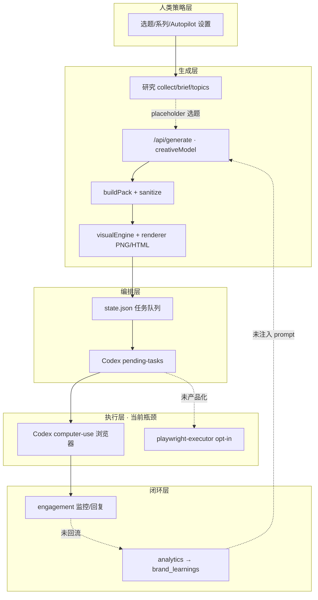

# Agent Studio Content OS · 产品升级蓝图（v0.4 → v1.0）

> **文档性质**：基于你提供的 `agent-studio-content-os-main.zip`（v0.4.0）全量代码审读 + 架构文档交叉验证  
> **撰写视角**：把你当作「要做成可给别人用的内容操作系统」的创作者，而不是「再修几个 bug 的开发者」  
> **日期**：2026-06-02  

---

## 0. 一句话结论（先给你定心丸）

你已经搭好了一条**很少见、且方向正确**的链路：**研究 → 内容包 → 视觉资产 → Codex/浏览器执行 → 互动 → 复盘**。v0.4 在「模型真正进生成」「Autopilot 状态回写」「renderer 不 500」上迈了一大步。

但产品离「别人愿意付费每天用」还差三块硬骨头：

1. **控制台仍是工程师视角**——能生成，却不能像小红书/抖音后台那样「看见成品」；
2. **评论回复是规则模板，不是人格**——和你对「创意 / 去 AI 味」的预期错位；
3. **商业化骨架在文档里，运行时在单用户 JSON 文件里**——`schema.sql` 有 `users`，`store.js` 没有。

下面按你提的五个问题 + 链路 + Bug，给出可执行的升级蓝图。

---

## 1. 对你五个问题的直接回应

| # | 你的感受 | 代码事实 | 严重程度 | 升级优先级 |
|---|----------|----------|----------|------------|
| 1 | 界面不好看，没法预览生产内容 | `App.jsx` 约 2300 行单文件；预览主要是**文字样机 + SVG 条带**；PNG 只显示 `server/exports/...` 路径；**BFF 未挂载 `/exports` 静态目录**（文档写了 `previewUrl` 但 `index.js` 只 serve `dist`） | 高（体验断层） | **P0** |
| 2 | 自动回复没创意、AI 味重 | `engagement.js` 的 `draftReplyForItem` **纯规则 + 固定句式**；主内容有 `creativeModel.js` LLM，**评论链路未接模型** | 高（产品差异化） | **P0** |
| 3 | 生产链路是否还有问题 | 链路完整但**执行层依赖 Codex computer-use**（慢、飘）；前后端双引擎（`buildPack` 本地 vs BFF 模型）易不一致；研究/选题仍有 placeholder | 中高 | **P1** |
| 4 | 没有账号系统，没法给别人用 | `server/db/schema.sql` 定义了 `users/brands/...`；**运行时全是 `server/data/state.json`**，无 auth、无 tenant、API 无鉴权 | 高（无法 SaaS/团队） | **P1** |
| 5 | 社交平台图标是虚拟的 | `catalog.js` 里 `platformMeta.handle` 是 `"RED"`、`"DOUYIN"` 等**文字徽章**；`PlatformTabs` 用 Lucide + CSS 色条，**非官方品牌资产** | 中（信任感/卖相） | **P1** |

---

## 2. 产品现状：你已经有什么（值得保留的护城河）

### 2.1 架构真源（和 README 一致）

```text
React 控制台 (人类看板)
    ↓ REST/SSE
Hono BFF (server/src/index.js) — Agent 合约层
    ↓
内容引擎 (contentEngine.js) + 创意模型 (creativeModel.js)
视觉引擎 (visualEngine.js) + Playwright 渲染 (renderer.js)
    ↓
本地状态 (store.js → state.json) + Codex 任务队列
    ↓
本机已登录浏览器 (Codex / Playwright executor) — draft 默认
    ↓
trace / 截图 / 互动 / 复盘 回写
```

### 2.2 v0.4 已兑现的能力（不要推倒重来）

- **`/api/generate`**：配置了 `CREATIVE_TEXT_API_KEY` 时走真实 LLM，失败降级确定性 `buildPack`（`buildPackWithCreative`）。
- **Autopilot**：三窗口、主题池、素材化、Codex 入队；slot 状态可随 task-result 回写（UPGRADE_PLAN 已记录）。
- **Engagement**：风险分级、人工门槛、队列卡死清扫（`sweepStaleEngagementTasks`）。
- **Visual**：多 style recipe、XHS carousel、共享 Chromium renderer。
- **安全边界**：不存平台密码、默认 draft、`publish/schedule` 显式——这是对外讲故事时的**合规护城河**。

### 2.3 真实完成度表（诚实版）

| 模块 | 对外说法 | 代码完成度 | 说明 |
|------|----------|------------|------|
| 内容包生成 | Ready | **75%** | 有 LLM；本地 fallback 与 BFF 可能不同源；前端默认还展示 `localPack` 直到点「运行 Agent」 |
| 选题研究 | Ready | **45%** | connectors 有；`/api/research` 候选仍是 `*-placeholder` |
| Visual Studio | Ready | **70%** | Cover/Info/Chart/Motion HTML 可导出；Explain/Remotion 仍是 scaffold |
| 发布执行 | Ready | **50%** | 主路径 Codex computer-use；`playwright-executor.js` opt-in 未产品化 |
| 评论维护 | Ready | **40%** | 监控任务完整；回复草稿规则化，无 LLM、无 A/B 口吻 |
| 数据复盘 | Ready | **35%** | PostHog 需 key + project id；未闭环到选题池 |
| 多用户 / 商业化 | Planned | **10%** | 仅有 schema + Business 页面文案 |

---

## 3. 问题一：界面与预览——从「控制台」到「创作棚」

### 3.1 现状诊断

**工作台 (`StudioView`)** 当前预览层次：

1. **平台文案**：`CopyBlock` → `<pre>` 纯文本 + 标签行（像 IDE，不像帖子）。
2. **视频分镜**：抽象 `stageScreen`（bars + VO），不是 9:16 真机框。
3. **图文卡片**：`VisualCard` 是 CSS 假卡片（`tone-*` + accent），**不是** Playwright 导出的 PNG/HTML deck。
4. **Visual Studio**：仅有 Assets 页的 iframe HTML preview；PNG 结果组件 `VisualResultPreview` **只列文件名**，不 ``。

**关键 Bug（体验级）**：

- 导出 PNG 写入 `server/exports/...`，但 `index.js` 的 `serveStatic` 只服务 `dist`，**前端无法通过 URL 加载成品图**。
- `docs/VISUAL_ENGINES_INTEGRATION.md` 中的 `previewUrl: "/exports/..."` **在运行时代码未实现**。

### 3.2 设计方向（理解你的意图：要「看见会发出去的样子」）

建议新增 **`Preview Hub`（预览中枢）** 作为 P0 核心页面，而不是继续往 `App.jsx` 堆卡片。

```text
┌─────────────────────────────────────────────────────────────┐
│  Preview Hub                                                │
│  ┌──────────┐  ┌──────────────────────────────────────────┐ │
│  │ 平台切换  │  │  Device Frame (XHS 3:4 / Douyin 9:16…)   │ │
│  │ 真 SVG   │  │  ┌────────────────────────────────────┐  │ │
│  │ 品牌标   │  │  │  Layer: 文案 overlay / 卡片轮播     │  │ │
│  └──────────┘  │  │  Layer: 导出 PNG 或 iframe deck     │  │ │
│                 │  └────────────────────────────────────┘  │ │
│  ┌──────────┐  │  [原图] [平台裁切] [安全区] [暗色模式]     │ │
│  │ 资产时间线│  └──────────────────────────────────────────┘ │
│  └──────────┘  底部：一键复制 / 导出 / 排队发布               │
└─────────────────────────────────────────────────────────────┘
```

### 3.3 P0 技术任务清单

| 任务 | 做法 | 验收 |
|------|------|------|
| 挂载导出资源 | BFF 增加 `app.use('/exports/*', serveStatic({ root: 'server/exports' }))`，返回带 `previewUrl` 的绝对路径 | 浏览器打开 `http://127.0.0.1:48787/exports/covers/xxx.png` 可见图 |
| 生成即预览 | `export-png` / smoke / autopilot 素材化响应增加 `files[].url` | 控制台 `` 直接渲染，不再只显示 `fileChip` |
| 拆分 `App.jsx` | `src/views/Studio.jsx`、`PreviewHub.jsx`、`Engagement.jsx`… | 单文件 < 400 行，可独立改 UI |
| 平台真机框 | 用 CSS device chrome（非商标侵权：通用手机框 + 平台主色顶栏） | 小红书/抖音切换时比例、圆角、字号联动变化 |
| 文案 WYSIWYG | 平台文案区改为「标题 + 正文 markdown 渲染 + 标签 chips」 | 复制前所见即所得 |
| 双源一致性提示 | 显示 `streamSource: bff | local-fallback` 横幅 | 用户知道当前预览是否等于将发布的包 |

### 3.4 视觉升级原则（好看但不 AI slop）

- **少渐变紫、多 editorial 留白**：你已有 `editorial-magazine`、`guizang-swiss` 等 style，应提升到**默认工作台皮肤**，而不是藏在 Visual Studio 下拉里。
- **信息层级**：标题 1 条、结论 1 条、卡片 6 张可横向滑动——对齐小红书消费节奏。
- **暗色工作台 + 亮色预览区**：预览区模拟「平台白底」，减少「黑客控制台」感。

---

## 4. 问题二：评论回复——从「客服模板」到「主理人口吻」

### 4.1 现状：为什么 AI 味浓

`server/src/engagement.js` 中 `draftReplyForItem` 逻辑本质是：

```javascript
// 典型输出模式（归纳）
「可以，我理解你问的是「${text}」。先给一个短结论：要看具体场景…」
「谢谢反馈，我先记下这个点。回复会保持${voice}，后面会补…」
```

特征：

- **复述用户原句**（最像机器人的习惯）；
- **万能过渡句**（「先看场景和约束」「整理成更完整的一期」）；
- **`brandVoice` 只拼进一句**，没有样本、没有历史、没有帖子上下文；
- **与 `contentEngine.js` 的 `deAiCopy` / `fillerTerms` 检测脱节**——生成端防 AI 味，回复端反而模板化。

主内容 `creativeModel.js` 的 system prompt 已经很讲究（禁止赋能/抓手/矩阵等），**评论没有同等对待**。

### 4.2 升级方案：`Engagement Voice Engine`（P0）

新建 `server/src/engagementCreative.js`，与 `creativeModel.js` 对称：

| 维度 | 规则层（保留） | 模型层（新增） |
|------|----------------|----------------|
| 安全 | `highRiskPattern` → 强制人工 | 模型不得覆盖 |
| 商业合作 | 意图 `business` | 短问三要素，禁止报价承诺 |
| 普通评论 | 仅作 fallback | 主路径 |
| 私信 | 默认人工 | 可选「签收句」模型生成 |

**System prompt 要点（建议原文写入代码）**：

1. 你是账号主理人，不是品牌客服；允许口语、半句、反问、留白。
2. **禁止**复述用户评论原文；用「你提到的那个点」代替引号复读。
3. 长度：评论 40–120 字；私信 80–200 字。
4. 每条回复必须包含 **一个具体动作**（去看某期、某张图、某个步骤）或 **一个真实边界**（不适合谁、别踩什么坑）。
5. 注入上下文：`postTitle`、`brandVoice`、最近 3 条已回复、该用户是否回头客（hash author）。
6. 输出 JSON：`{ reply, toneTag, shouldPin, followUpTopic }`，便于回流选题池。

**反 AI 味后处理**（复用 `contentEngine`）：

- 跑 `fillerTerms` + 新增评论套话表：`「感谢关注」「希望对你有帮助」「欢迎关注」` 等；
- 命中则自动重写或降级到「短真人版」规则库（10–15 条你手写的高质量种子回复轮换）。

### 4.3 产品交互升级

- 互动收件箱：每条草稿旁加 **「更像人 / 更锋利 / 更短」** 三个 one-click 变体（调 temperature + style preset）。
- **回复前预览**：模拟小红书评论气泡 UI（与 Preview Hub 共用组件）。
- **学习闭环**：用户编辑过的最终 `replyText` 写入 `brand_learnings` → 下轮 prompt few-shot（本地先 JSON，后 Postgres）。

### 4.4 验收标准

- 盲测：10 条真实评论，团队打分「像真人主理人」≥ 7/10；
- 零条出现「我理解你问的是『…』」；
- 高风险评论 100% `requiresHuman`，无自动发送。

---

## 5. 问题三：生产链路审计——断点与修复顺序

### 5.1 端到端链路图（含已知断点）



### 5.2 断点清单（按修复顺序）

| 断点 | 现象 | 根因 | 修复 |
|------|------|------|------|
| **E1 执行慢/失败** | 任务超窗口、queued 久 | 默认 Codex UI 自动化 | P1：Playwright 持久化 profile 为主力；Codex 仅 fallback |
| **E2 双引擎不一致** | 不点 Agent 时看到的是本地 pack | `pack = generatedPack \|\| localPack` | 默认自动拉 BFF；或 UI 标明「演示数据」 |
| **E3 研究假数据** | 选题分数很高但 source 是 placeholder | `/api/research` 硬编码 | 接 Tavily/Firecrawl 或显式「演示模式」徽章 |
| **E4 预览不可见** | PNG 路径无法在 UI 显示 | 未 serve exports | P0 静态挂载 |
| **E5 视频链路空** | motion 只有 HTML scaffold | ffmpeg/Remotion 未接 | P2：先 Hyperframes HTML 录屏方案 |
| **E6 评论不回流选题** | engagement intent 未写 topicQueue | `recordEngagementResult` 无回流 | P2：`followUpTopic` → autopilot topics |
| **E7 复盘不反哺** | brand_learnings 未进 generate | 存储与 prompt 未接 | P2：generate 读取最近 learnings |
| **E8 部署分叉** | 安装目录 vs git 不一致 | 历史运维习惯 | 坚持 git 真源 + health.build（已有） |

### 5.3 Autopilot 专项（你的「全自动」核心）

当前 `autopilot.js` 能力较强，但运营上需注意：

- **`mode: publish`** 默认值偏激进——对新用户应默认 `draft`，商业化分 tier 开放 publish。
- **素材化一次生成多资产**（cover/info/infographic/chart/motion）——任何一步 renderer 失败应**部分成功 + 明确缺件**，而不是整 slot 失败。
- **随机发布时间**在窗口内——需 UI 展示「下一次触发时间」倒计时，否则用户以为挂了。

---

## 6. 问题四：账号与多租户——从「Leo 的本机脚本」到「可交付产品」

### 6.1 现状

- `store.js`：`accountLabel: "Leo"` 只是字符串标签；
- **无** login、session、RBAC、API key per workspace；
- `schema.sql` 已有完整商业模型（`users → brands → topics → packs → publishes → comments → brand_learnings`），**零迁移脚本、零 ORM**；
- `docs/COMMERCIALIZATION.md` 定价档（Free / Pro / Studio）**无代码 enforcement**。

### 6.2 推荐分阶段（不要一步到位 Supabase）

**Phase A — 本地多工作区（1–2 周）**

- `state.json` → `state/{workspaceId}.json`；
- 启动时 `WORKSPACE_ID` 或 UI 切换 workspace；
- 每个 workspace：`brandVoice`、平台账号 label、Autopilot 设置隔离。

**Phase B — SQLite + 鉴权（2–3 周）**

- `better-sqlite3` 实现 schema 子集（users, brands, browser_tasks, engagement_items）；
- 邮箱 magic link 或简单 password（bcrypt）+ HttpOnly session；
- 所有 `/api/*` 除 `/api/health` 需 `Authorization: Bearer` 或 session cookie。

**Phase C — 托管多租户（按需）**

- Supabase/Neon + RLS；
- 计划限额：Free 10 packs/月（`docs/COMMERCIALIZATION.md` 已有表述）。

### 6.3 给别人用时还必须补的「产品壳」

| 能力 | 说明 |
|------|------|
| Onboarding | 连 API key → 选平台 → 导入 brandVoice → 第一次 smoke test |
| 审批流 | Autopilot publish 需「待批准」队列 |
| 审计日志 | 谁点了发布、谁改了回复 |
| 配额 | packs/日、回复条数/日、renderer 并发 |
| 数据导出 | GDPR 式导出 workspace JSON |

---

## 7. 问题五：平台图标与品牌信任感

### 7.1 现状

`PlatformTabs` 渲染：

```jsx
<div className="pHandle">{m.handle}</div>  // "RED", "DOUYIN", "X" ...
```

这是**内部代号徽章**，不是用户认知中的平台 Logo。对 MCN、品牌方、外投演示会削弱「这是真能做全平台」的信任。

### 7.2 合规做法（可用真样式，不侵权）

| 方案 | 做法 | 风险 |
|------|------|------|
| **A. 官方 Brand Guidelines** | 下载各平台媒体 kit 中的 **图标字形**（通常允许「指向下游服务」场景） | 需逐平台读条款 |
| **B. Simple Icons / 类似开源集** | SVG sprite，`aria-label` 用中文名 | 注意个别平台限制商用 |
| **C. 中性「渠道」图标** | 书本（小红书）、音符（抖音）等 **隐喻图标** + 正确品牌色 | 最安全，识别度略低 |

**推荐**：B + C 混合——主 UI 用 Simple Icons；对外 deck 用官方 kit。

### 7.3 实现任务

- 新增 `src/components/PlatformIcon.jsx`：`platform` → SVG组件；
- `catalog.js` 增加 `brandColor`, `iconId`, `safeDisplayName`；
- 发布助手步骤条、Autopilot slot 卡片、Engagement 收件箱统一替换 `pHandle` 文本徽章。

---

## 8. Bug 与风险寄存器（审读中发现）

### 8.1 已修（v0.4，避免重复踩坑）

见仓库 `UPGRADE_PLAN.md`：slot 不回写、LLM 未接入、carousel 500、renderer 每图起浏览器等。

### 8.2 仍开放 / 待验证

| ID | 类型 | 描述 | 建议 |
|----|------|------|------|
| B01 | **功能** | `/exports` 未 HTTP 暴露，预览链路断裂 | P0 |
| B02 | **功能** | 评论回复无 LLM，`brandVoice` 几乎无效 | P0 |
| B03 | **架构** | `App.jsx` 单文件过大，难维护、易回归 | P0 拆分 |
| B04 | **数据** | `state.json` 单文件膨胀，无清理策略 | P1 SQLite |
| B05 | **安全** | API 无鉴权，本机端口暴露即全权限 | P1 |
| B06 | **产品** | 研究 API placeholder 与真实 connector 混用 | UI 标注 + P2 接通 |
| B07 | **执行** | Codex 队列积压时依赖 stale sweep，可能误杀长任务 | 区分 publish vs engagement 阈值（部分已有） |
| B08 | **一致** | 前端 `localPack` 与 BFF pack 字段可能不同步 | 统一 schema 校验 |
| B09 | **文档** | `previewUrl` 文档与实现不符 | 修代码或改文档 |
| B10 | **依赖** | 本环境 `pnpm`/`vitest` 未装，无法在此复跑 40 tests | CI 加 `npm test` |

### 8.3 安全提醒（保持你的护城河叙事）

- 坚持 **不存平台密码、不绕过验证码**——升级时不要为「方便」开后门；
- `allowMessageAutoReply` 默认 `false` 是对的；上线前加**二次确认** UI；
- `engagement` 自动回复需**每分钟条数上限 + 随机延迟**，模拟人类节奏。

---

## 9. 升级路线图（建议 12 周，可并行）

### Phase 0 · 「能看见成品」（第 1–2 周）— 对齐你的 #1

- [ ] `/exports` 静态服务 + 预览 URL
- [ ] Preview Hub 页面 + 真机框
- [ ] PNG/HTML 内联预览，去掉纯路径列表
- [ ] 拆分 `App.jsx`

**里程碑**：导出小红书 deck 后，**不打开文件夹**也能在浏览器里翻 6 张图。

### Phase 1 · 「像主理人说话」（第 2–4 周）— 对齐你的 #2

- [ ] `engagementCreative.js` + LLM 回复
- [ ] 反 AI 味后处理 + 3 变体按钮
- [ ] 回复气泡预览
- [ ] 人工编辑回写 learnings（JSON 版）

**里程碑**：盲测评论回复「真人感」显著提升，且无高风险自动发送。

### Phase 2 · 「链路跑稳」（第 4–8 周）— 对齐你的 #3

- [ ] Playwright executor 产品化（设置页一键启用 user-data-dir）
- [ ] Codex fallback 策略文档化 + 自动切换
- [ ] 研究层接真 API 或演示模式开关
- [ ] engagement → topicQueue 回流
- [ ] analytics learnings 注入 `generateCreativeContent`

**里程碑**：从早到晚 Autopilot 三槽位，**≥80%** 无需 Codex UI 点选即可完成 draft 上传。

### Phase 3 · 「别人能用」（第 6–10 周）— 对齐你的 #4

- [ ] Workspace 隔离
- [ ] SQLite 迁移 + 基础 auth
- [ ] 配额与审批流
- [ ] Onboarding 向导

**里程碑**：第二个用户在同一台 Mac 上登录不同 workspace，互不见任务队列。

### Phase 4 · 「卖相与品牌」（第 8–12 周）— 对齐你的 #5 + 商业化

- [ ] 平台官方/开源图标体系
- [ ] 工作台视觉统一（editorial 默认主题）
- [ ] Business 页与真实 plan 限制打通
- [ ] 部署一键脚本 + health.build 校验

**里程碑**：对外 10 分钟演示：注册 → 生成 → 预览 → 排队 draft → 看互动草稿。

---

## 10. 文件级改造地图（工程师可直接拆 ticket）

| 区域 | 关键文件 | 改造类型 |
|------|----------|----------|
| 预览 | `server/src/index.js`, 新建 `src/views/PreviewHub.jsx` | 静态路由 + UI |
| 评论 | `server/src/engagement.js`, 新建 `engagementCreative.js` | LLM + 回流 |
| 链路 | `scripts/playwright-executor.js`, `server/src/autopilot.js` | 执行器默认化 |
| 账号 | `server/src/store.js` → `db/`, `schema.sql` | 迁移 |
| 图标 | `src/lib/catalog.js`, 新建 `PlatformIcon.jsx` | 资产 |
| 拆分 | `src/App.jsx` → `src/views/*`, `src/components/*` | 重构 |

---

## 11. 与你意图的对齐说明（为什么这样排期）

你要的不是「再加几个 API」，而是：

1. **创作时有爽感**——看见真实卡片、真实比例、真实平台壳；
2. **互动时有性格**——像 Leo 在回评论，而不是客服机器人；
3. **夜里能自己跑**——但早上打开能看懂昨晚发生了什么、哪里失败了；
4. **有一天能给别人用**——合伙人、客户、MCN 助理各用各的 workspace；
5. **对外演示不尴尬**——平台标、预览、链路故事一致。

因此优先级是：**预览 > 评论人格 > 执行稳定 > 账号 > 图标美观**。这和代码里「生成很强、执行很虚、回复很模板、预览断裂」的现状一致。

---

## 12. 立即可做的 3 件事（今天就能验证）

在仓库根目录：

```bash
cd /Users/leoyuan/Downloads/agent-studio-content-os-main
npm install
npx playwright install chromium
cp .env.example .env
# 填入 CREATIVE_TEXT_API_KEY
npm run build
PORT=48787 FRONTEND_PORT=45173 npm run local:start
```

1. 打开控制台 → 运行 Agent → 看 `streamSource` 是否为 `bff`。
2. Visual Studio → 导出 PNG → 目前只能看路径；按本文 P0 加 `/exports` 后即可浏览器看图。
3. 互动监控 → 看 `replyDraft` 是否仍是「我理解你问的是…」句式——印证要上 Engagement Voice Engine。

---

## 13. 版本命名建议

| 版本 | 主题 |
|------|------|
| **v0.5** | Preview Hub + exports 可访问 + App 拆分 |
| **v0.6** | Engagement Voice Engine（LLM 回复） |
| **v0.7** | Playwright 执行器默认化 + 回流选题 |
| **v1.0** | Workspace + Auth + 配额（可给别人用） |

---

## 附录 A · 核心 API 与前端映射（便于你对照）

| 用户动作 | API | 前端入口 |
|----------|-----|----------|
| 生成内容包 | `POST /api/generate` (SSE) | 工作台 · 运行 Agent |
| 导出 PNG | `POST /api/assets/export-png` | Visual Studio |
| 图文 golden path | `POST /api/smoke/graphic` | 工作台 smoke |
| 自动发布 | `GET/POST /api/autopilot/*` | 自动发布页 |
| 互动 | `POST /api/engagement/check-now` | 互动监控页 |
| Codex 消费 | `GET /api/codex/pending-tasks` | `scripts/codex-poll.js` |

---

## 附录 B · 环境变量与「真能力」关系

| 变量 | 影响 |
|------|------|
| `CREATIVE_TEXT_API_KEY` | 主内容是否走 LLM |
| `TAVILY_API_KEY` 等 | 研究是否真实 |
| `POSTHOG_*` | 复盘是否真实 |
| `BROWSER_AGENT_RUNTIME` | 执行器选择 |
| 未配置 | 全面降级为本地确定性逻辑——**能演示，不能声称全自动高质量** |

---

*文档结束。若你确认 Phase 0 优先级，可从「挂载 `/exports` + Preview Hub」开始直接改代码并提 PR。*