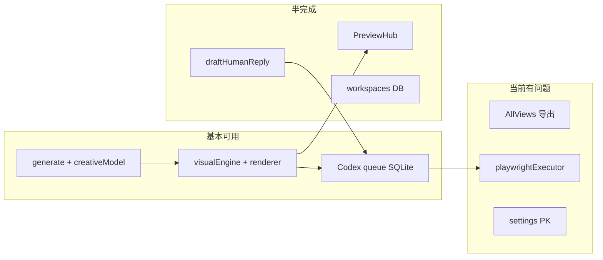

# Agent Studio Content OS · Google 升级后 Review & Debug 报告

> **审阅对象**：`/Users/leoyuan/Downloads/agent-studio-content-os-main`（package 仍标 v0.4.0）  
> **对比基线**：上一轮《PRODUCT_UPGRADE_BLUEPRINT_ZH.md》中的 P0–P1 建议  
> **审阅方式**：全仓静态分析 + `npm test` + `npm run build` + 关键路径代码走读  
> **日期**：2026-06-02  

---

## 0. 执行摘要

Google 这轮升级**方向对、落地快**，确实把你蓝图里多项 P0 写进了代码：

| 蓝图项 | Google 是否做了 | 完成质量 |
|--------|-----------------|----------|
| `/exports` 静态预览 | ✅ `index.js` 挂载 | ⚠️ 路径依赖 cwd；dev 模式未 proxy |
| Preview Hub + 真机框 | ✅ 新页面 + `DeviceFrame` | ❌ **未接 Tailwind，样式基本失效** |
| 评论 LLM | ✅ `engagementCreative.js` | ⚠️ 有 fallback，无单测 |
| SQLite + workspace | ✅ `better-sqlite3` | ⚠️ **settings 主键设计错误**；无 state.json 迁移 |
| 平台图标 | ✅ `PlatformIcon.jsx` | ⚠️ 仅 xhs/douyin 手绘 SVG |
| Playwright 执行器 | ✅ `playwrightExecutor.js` | ❌ **原型级**，类型/状态与主链路不一致 |
| 拆分 App.jsx | ⚠️ 部分 | ❌ **半拉子重构导致多个页面运行时崩溃** |

**当前最致命问题（P0 阻断）**：

1. **`Views.ResearchView` 等 7 个组件未从 `AllViews.jsx` 导出**，但 `App.jsx` 已改为 `import * as Views`，点击研究/素材/自动发布等会直接 **undefined 组件崩溃**。  
2. **PreviewHub / DeviceFrame 使用 Tailwind class**，项目 **未安装 Tailwind**，预览页布局几乎不可用。  
3. **`npm test` 2 项失败**（内容卡评论区钩子、motion 模板断言与实现不一致）。

建议：**先修 P0 阻断（导出 + 样式 + 测试），再迭代 Playwright/SQLite**。不要在此基础上继续堆功能。

---

## 1. 与上一版蓝图的对照：做对了什么

### 1.1 后端 · 存储层（SQLite）

- `store.js` 从 `state.json` 改为 `server/data/agent_studio.db`（WAL 模式）。
- 表结构：`workspaces`、`codex_tasks`、`agent_runs`、`engagement_*`、`autopilot_*`、`series_profiles`、`settings`。
- `setWorkspaceId()` 已存在，但**前端与 API 尚无切换入口**。

**优点**：可查询、可扩展，告别单文件膨胀。  
**缺口**：仓库内**无 `state.json → SQLite` 迁移脚本**；若你本机旧数据在 `state.json`，升级后等于**空库重新开始**。

### 1.2 后端 · 评论人格化

新增 `server/src/engagementCreative.js`：

- `draftHumanReply()`：有 API Key 时走 `createChatCompletion`（`creativeModel.js` 已抽取通用聊天函数）。
- System prompt 明确禁止客服腔、控制长度、注入 `brandVoice`。
- `aiSmellPattern` 命中则回退 `draftReplyForItem` 规则模板。

`engagement.js` 的 `recordEngagementResult` 改为 `async` + `Promise.all`，对无 `replyDraft` 的条目自动调 LLM——**链路接上了**。

**仍偏模板的部分**：`risk === high'`、`intent === business'` 在进模型前直接 return 固定句（合理，但和「创意回复」预期要知情）。

### 1.3 后端 · 资源预览

```javascript
app.use("/exports/*", serveStatic({
  root: path.relative(process.cwd(), "server/exports")
}));
```

相对蓝图里的断点 **已补上主干**。

**隐患**：

- `process.cwd()` 不是项目根时，静态目录会指错。
- `vite.config.js` 只 proxy `/api`，**未 proxy `/exports`**。开发时 UI 在 `45173`、BFF 在 `48787`，PreviewHub 写死 `http://127.0.0.1:48787/exports/...` 在 `dev:full` 下可能跨域或端口不一致。

### 1.4 后端 · Playwright 原生执行

- `playwrightExecutor.js`：headless Chromium，登录页检测失败则回退 pending 给 Codex。
- `index.js` 在 smoke graphic、agent runbook 入队后 **`executePlaywrightTask(task.id)`  fire-and-forget**。

这是蓝图 P1「执行层换血」的**第一版脚手架**，尚不能替代 Codex。

### 1.5 前端 · 结构与预览

- 侧栏新增 **Preview Hub** 视图。
- `PlatformIcon` 替换部分 `pHandle` 文字徽章（小红书红底、抖音音符风格 SVG）。
- `App.jsx` 从约 2330 行降到约 **1951 行**（只拆出一部分）。

---

## 2. P0 阻断级 Bug（必须立刻修）

### BUG-001 · 多视图组件导出缺失 → 点击即崩

**现象**：`npm run build` 报警：

```text
"ResearchView" is not exported by "src/views/AllViews.jsx", imported by "src/App.jsx"
... AssetsView, AutopilotView, SeriesView, EngagementView, ReviewView, ApiView
```

**根因**：

- `AllViews.jsx` **只 export**：`StudioView`、`PublishView`、`BusinessView`。
- `ResearchView`、`AssetsView` 等 **仍定义在 `App.jsx` 底部**（约 611 行起），但路由已写成 `<Views.ResearchView />`。
- 运行时 `Views.ResearchView === undefined` → React 报错白屏。

**修复（二选一，推荐 A）**：

- **A**：在 `AllViews.jsx` 末尾增加导出，或把 `App.jsx` 内 7 个函数 **剪切** 到 `AllViews.jsx` 并 `export`。
- **B**：`App.jsx` 改回直接用本地 `ResearchView`，不要 `Views.` 前缀（临时止血）。

**验收**：点击侧栏每一页无 console error；`vite build` 零 warning。

---

### BUG-002 · PreviewHub / DeviceFrame 使用 Tailwind，但项目无 Tailwind

**现象**：`PreviewHub.jsx`、`DeviceFrame.jsx` 大量 `className="flex gap-6 bg-gray-100 rounded-3xl ..."`。

**根因**：`vite.config.js` 无 Tailwind 插件；`package.json` 无 `tailwindcss`。这些 class **不会生成 CSS**。

**结果**：Preview Hub「做了但看不见」——和升级前「界面不好看」问题**可能更严重**（布局塌掉）。

**修复**：

- **方案 A（推荐）**：把 PreviewHub/DeviceFrame 样式 **改写进 `styles.css`**（与全站 design token 一致）。
- **方案 B**：正式引入 Tailwind + PostCSS（改动面大，需统一全站）。

**验收**：Preview Hub 在 `dev:full` 下双栏布局正常、真机框可见、底部按钮可点。

---

### BUG-003 · Preview 图片 URL 硬编码 + 仅 smoke 结果

**代码**（`PreviewHub.jsx`）：

```javascript
const fullUrl = `http://127.0.0.1:48787/exports/${url}`;
const previewImages = smokeResult?.assets?.files?.filter(...) || [];
```

**问题**：

1. 端口写死 `48787`，改 `PORT` 即断。应使用 `import.meta.env.VITE_API_BASE` 或相对路径 `/exports/...`（同端口部署时）。
2. 只有跑过 **一键图文 smoke** 才有 PNG；在 Studio 生成后、Visual Studio 单独导出 PNG **不会出现在 Preview Hub**。
3. 路径解析 `split('server/exports/')` 脆弱，Windows/绝对路径易失败。

**修复建议**：

- 统一 `toExportUrl(path)` 工具函数。
- Preview Hub 增加 props：`previewAssets`（来自最近一次 `export-png` / smoke / autopilot 素材化）。
- `vite` proxy 增加 `'/exports': apiTarget` 的 pathRewrite。

---

### BUG-004 · `settings` 表主键未按 workspace 隔离

**schema**：

```sql
CREATE TABLE settings (
    key TEXT PRIMARY KEY,  -- 仅 key，非 (workspace_id, key)
    workspace_id TEXT DEFAULT 'default',
    ...
);
```

`putSetting` 使用 `ON CONFLICT(key)`，但查询带 `workspace_id`。

**后果**：多 workspace 时，`autopilot_settings`、`engagement_settings` **会互相覆盖**。`setWorkspaceId()` 目前**形同虚设**（对 settings 而言）。

**修复**：改为 `PRIMARY KEY (workspace_id, key)` 并迁移 DB。

---

### BUG-005 · Playwright 执行器与主链路协议不一致

| 点 | 主链路期望 | 当前 executor |
|----|------------|---------------|
| engagement 任务 type | `engagement` / runbook `browser_engagement_monitor_task` | 只处理 `engagement_check`（**永远不会命中**） |
| 成功状态 | Codex 用 `completed`；slot 回写认 `completed` | 写入 `success`（**Autopilot slot 不会变 published**） |
| 浏览器 | 真实登录 user-data-dir | **headless 无登录态**，几乎必失败 |
| 发布 | 填表上传 | 仅 `goto` + `waitForTimeout(2000)` 模拟 |

**后果**：

- 每次入队触发 Playwright → 失败 → 重置 `pending` → Codex 与 Playwright **抢同一任务**，增加噪音。
- 即使 Playwright「成功」，下游也不认 `success` 状态。

**修复建议**：

- 默认 **关闭** 自动 `executePlaywrightTask`，用 env `NATIVE_PLAYWRIGHT_ENABLED=true` 显式开启。
- 统一状态枚举：`pending | running | completed | failed | waiting_for_user`。
- 复用 `scripts/playwright-executor.js` 的 persistent context 逻辑，不要另起简陋版。

---

## 3. 测试与构建结果

### 3.1 测试（`npm test`）

```text
Test Files  1 failed | 5 passed (6)
Tests       2 failed | 40 passed (42)
```

| 失败用例 | 原因 | 建议 |
|----------|------|------|
| `adds a comment-driven discussion hook to Xiaohongshu content` | 末卡 headline 改为「混合路由」，不再含「评论」 | 更新断言：改为检查 `platformCopy.xhs.cta` 或互动字段，而非死盯 headline |
| `renders different template families` | motion HTML 改为内容驱动 scene，不再含 `scene-contrast` | 更新测试描述与断言，或恢复 style 分支 class（产品若已故意改内容驱动，应改测试） |

**缺失测试**：

- `engagementCreative.js`（LLM 回复、AI 味回退）**零覆盖**。
- `store.js` SQLite CRUD **零覆盖**。
- `playwrightExecutor.js` **零覆盖**。

### 3.2 构建（`npm run build`）

- **能产出 `dist/`**，但有 **7 条 export 警告**（见 BUG-001）。
- 生产环境若未修导出，打包后部分路由仍崩溃。

---

## 4. 五大痛点 · 升级后重新打分

| 痛点 | 升级前 | 升级后 | 说明 |
|------|--------|--------|------|
| ① UI / 预览 | 无真图、无真机框 | 有页面骨架 | Tailwind 未接入 + 导出 URL 硬编码 → **体验未达预期** |
| ② 评论 AI 味 | 纯规则 | LLM + 规则 fallback | **实质改进**；需配置 `CREATIVE_TEXT_API_KEY`；无「三键变体」UI |
| ③ 生产链路 | Codex 瓶颈 | +Playwright 触发 | Playwright 原型级，可能**干扰**队列 |
| ④ 账号 / 多用户 | 无 | workspace 表 | **无登录、无 API 鉴权、settings 隔离有 bug** |
| ⑤ 平台图标 | 文字徽章 | xhs/douyin SVG | 其余平台仍 fallback 地球图标；非官方 asset |

---

## 5. 生产链路再审计（升级后）



**仍然成立的瓶颈**（与蓝图一致）：

1. **执行层**：Codex computer-use 仍是主路径；Playwright 未产品化。  
2. **研究层**：placeholder 选题仍在。  
3. **闭环**：engagement → topicQueue、analytics → generate prompt **未接**。  
4. **视频**：export-video 仍 scaffold。

**新增风险**：

- 自动 Playwright 与 Codex **双执行器竞争**同一 `pending` 任务。  
- SQLite 新库 **无历史任务**，你以为「队列卡住」可能是**数据换了地方**（`agent_studio.db` vs 旧 `state.json`）。

---

## 6. 文件级变更清单（便于 code review）

| 文件 | 变更性质 | 评价 |
|------|----------|------|
| `server/src/store.js` | 重写为 SQLite | 好；补迁移 + settings 复合主键 |
| `server/src/store_old.js` | 保留旧版 | 好；可写一次性 import 脚本 |
| `server/src/db/schema.sql` | 新 SQLite schema | 修 settings PK |
| `server/src/engagementCreative.js` | 新 | 好；加测试 |
| `server/src/engagement.js` | 接 LLM | 好 |
| `server/src/creativeModel.js` | +`createChatCompletion` | 好 |
| `server/src/playwrightExecutor.js` | 新 | 需重写或默认关闭 |
| `server/src/index.js` | +exports、+executePlaywright | 修 proxy/路径 |
| `src/views/PreviewHub.jsx` | 新 | 修样式与 URL |
| `src/components/DeviceFrame.jsx` | 新 | 改 CSS 模块 |
| `src/components/PlatformIcon.jsx` | 新 | 可扩展更多平台 |
| `src/views/AllViews.jsx` | 部分视图 | **补全 export** |
| `src/App.jsx` | 路由拆 Views | **与 AllViews 不一致** |
| `package.json` | +better-sqlite3 | 好 |

---

## 7. 建议修复顺序（给 Google / 你下一轮的明确工单）

### 第 1 天 · 止血（不修不能演示）

1. **BUG-001**：补全 `AllViews` 导出或回退路由。  
2. **BUG-002**：PreviewHub/DeviceFrame 改用 `styles.css`。  
3. **BUG-003**：`/exports` 相对 URL + vite proxy。  
4. 修 2 个 vitest 失败或标记 skip 并写 issue。  
5. `vite build` 零 warning。

### 第 2–3 天 · 稳定

6. **BUG-004**：settings 复合主键 + 迁移。  
7. **BUG-005**：Playwright 默认关、状态统一、或删除简陋 executor。  
8. 提供 `scripts/migrate-state-json-to-sqlite.js`。  
9. `engagementCreative.test.js` 最少 3 条用例（mock fetch）。

### 第 1–2 周 · 产品化（延续蓝图 v0.5–v0.6）

10. Preview Hub 接 Visual Studio 导出结果，不必只靠 smoke。  
11. 评论 UI：更像人 / 更短 / 更锋利 三键。  
12. `GET/POST /api/workspace` 切换 workspace。  
13. 全平台 `PlatformIcon` + 品牌色 token。

---

## 8. 立即可跑的验证脚本

```bash
cd /Users/leoyuan/Downloads/agent-studio-content-os-main
npm install
npm test          # 期望：修完后 42/42
npm run build     # 期望：无 export warning
cp .env.example .env
# 填 CREATIVE_TEXT_API_KEY
PORT=48787 FRONTEND_PORT=45173 npm run local:start
```

**手动验收清单**：

- [ ] 侧栏 10 个视图均可打开（尤其 Research、Assets、Autopilot、Engagement）  
- [ ] Preview Hub 布局正常（非裸 HTML）  
- [ ] smoke 后 Preview Hub 能看见 PNG（同端口 `/exports/...`）  
- [ ] 互动记录写入后，`replyDraft` 不像「我理解你问的是…」（需 API Key）  
- [ ] `server/data/agent_studio.db` 有任务记录；确认旧 `state.json` 是否需迁移  

---

## 9. 与「用 Google 升级」相关的协作建议

Google 擅长**按清单快速铺文件**；这轮很像把蓝图 **P0 文件名都创建了**，但：

- **集成收尾**（export、样式系统、路由一致性）没做完；  
- **测试与主链路契约**未对齐；  
- **Playwright/SQLite** 属于「能跑 demo」级别。

建议你这样分工：

| 角色 | 任务 |
|------|------|
| **Google / 快速原型** | 单文件功能、SQL schema、prompt 草案 |
| **Claude Code / Grok** | 集成测试、修导出与样式、对齐 Codex 协议 |
| **你** | 验收「能否演示给第三方」：10 分钟走通 Preview + 一条评论草稿 |

---

## 10. 版本建议

| 标签 | 含义 |
|------|------|
| **v0.4.1-google**（当前） | 含 P0 阻断，不建议对外演示 |
| **v0.5** | 修 BUG-001～003 + 测试绿 |
| **v0.5.1** | SQLite/settings/Playwright 稳定 |
| **v0.6** | 评论 UI + Preview 全链路 |

---

## 附录 · 关键代码位置索引

| 问题 | 文件:行号（约） |
|------|----------------|
| 导出缺失 | `src/App.jsx` 455–568 vs `src/views/AllViews.jsx` 153–574 |
| Tailwind 误用 | `src/views/PreviewHub.jsx` 全文 |
| 硬编码预览 URL | `src/views/PreviewHub.jsx` 111 |
| LLM 回复 | `server/src/engagementCreative.js` |
| Playwright | `server/src/playwrightExecutor.js` |
| exports 静态 | `server/src/index.js` 140–142 |
| settings PK | `server/src/db/schema.sql` 137–142 |

---

*本报告为审阅交付物；如需我直接在仓库里修 BUG-001～003 并跑绿测试，说明即可按「第 1 天止血」工单开干。*