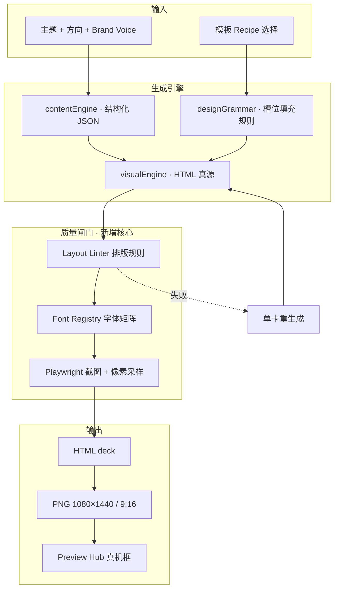

# Agent Studio Content OS · v0.6 升级计划

## 「模板真源 × 高保真视觉 × 零低级出错」

> **前置**：v0.5.0 止血已完成（42/42 测试、build 无 warning、Preview Hub 可用、exports 可预览）  
> **你的核心诉求**：在**模板仓库设计语法**之上，输出更创意、更高级、更可交付的视觉；减少字体过小、排版溢出、空卡、填充错位等「低级错误」。  
> **日期**：2026-06-02  

---

## 0. 本轮已交付（v0.5.0 · 我完成的修复）

| 项 | 内容 |
|----|------|
| 路由崩溃 | 研究/素材/自动发布等 7 页改回 `App.jsx` 内组件，不再引用未导出的 `Views.*` |
| Preview Hub | 重写为 `styles.css` 设计系统（弃用无效 Tailwind class） |
| 预览图 | `toExportUrl()` + vite `/exports` proxy + Visual Studio 导出联动 Preview |
| SQLite settings | 复合主键 `(workspace_id, key)` + 自动迁移旧表 |
| Playwright | 默认关闭（`NATIVE_PLAYWRIGHT_ENABLED=false`），避免与 Codex 抢队列 |
| 文案闭环 | `specificXhsBody` 补全 `discussionPrompt`（小红书互动引导） |
| 版本号 | `package.json` → **0.5.0** |

**验收命令**：

```bash
cd /Users/leoyuan/Downloads/agent-studio-content-os-main
npm test && npm run build
PORT=48787 FRONTEND_PORT=45173 npm run local:start
```

---

## 1. 问题定义：什么叫「低级出错」

结合 `renderer.js` 已有校验与线上反馈，把错误分成三层：

```text
L1 内容层   空句、模板腔、字段缺失、隐私词漏网
L2 排版层   字号 < 28px、安全区外溢、空卡、标题截断
L3 品牌层   风格漂移、像通用 AI 海报、不像小红书/抖音真实帖子
```

v0.5 解决了「看不见成品」；v0.6 要系统性消灭 **L2 + L3**，并让 L1 与模板仓库绑定。

---

## 2. 设计哲学（对齐你的模板仓库）

你已在 `docs/design-template-sources.md` 吸收四套语法，运行时落在 `src/lib/designGrammar.js` + `src/lib/visualEngine.js`：

| 来源 | v0.6 要兑现的能力 |
|------|-------------------|
| **frontend-slides-editable** | 预设布局槽位（hero / grid / CTA）可切换，不是换色皮肤 |
| **huashu-design** | 信息图「印刷级」层级：字阶、行距、留白比例写死 |
| **html-anything** | 按平台 surface 选 skill：XHS 轮播、Swiss 16 栏、Magazine Poster |
| **baoyu XHS recipes** | 产品实景 / 高密度信息图 / 流程分镜 三条硬约束 |

**v0.6 原则**：  
> 创意来自 **内容结构变化** 和 **版式语法变化**，不来自随机渐变和 AI 海报风。

---

## 3. v0.6 目标架构



---

## 4. 分阶段实施计划

### Phase A · 模板真源控制台（第 1–2 周）

**目标**：用户能「选模板语法 → 看见语法差异」，而不是 20 个风格名却不知道差别。

| 任务 | 说明 | 验收 |
|------|------|------|
| A1 Template Gallery | 新页或 Studio 侧栏：展示 8 个 showcase（XHS 3 recipe + Swiss + Magazine + Tabler + Landing） | 点选后 `visualStyle` 写入并持久化 |
| A2 Recipe Contract | 每个 recipe 输出 `manifest`: `{ slots, typography, colors, minFontPx, safeMargin }` | JSON schema 测试覆盖 |
| A3 绑定 contentEngine | 生成 pack 时带 `recommendedRecipe`（由 domain + direction 推导） | AI 主题默认 `xhs-dense-infographic`，产品主题默认 `xhs-product-real-scene` |
| A4 外部模板路径配置 | `.env` `TEMPLATE_REPO_ROOT` 指向你本地模板仓（只读扫描 manifest，不拷贝侵权素材） | 切换目录后 style-library API 更新 |

**创意点**：Gallery 用**同一主题**并排 3 张缩略图（不是文字列表），一眼看出「高级/editorial/dense」差异。

---

### Phase B · 字体与排版系统（第 2–3 周）— 直击「字体、排版出错」

**现状问题**：

- HTML 内联 `font-family: Inter, PingFang SC...` 不统一；Playwright 截图环境可能缺字体 → 回退宋体导致**字号视觉变小**。
- `small_text` 校验阈值 28px 已有，但**生成阶段不约束**，经常先导出再 422。

| 任务 | 说明 | 验收 |
|------|------|------|
| B1 Font Registry | `server/assets/fonts/` 嵌入 Noto Sans SC + 英文子集；CSS `@font-face` 统一引用 | 离线截图字体一致 |
| B2 Type Scale Token | `--type-display: 88px` / `--type-title: 52px` / `--type-body: 32px`（XHS 1080 宽基准） | 禁止 generator 写死魔法数 |
| B3 Pre-render Linter | 在 `renderXhsCarouselHtml` **之后、Playwright 之前** 用 cheerio/jsdom 解析 HTML 检查：空槽、超长标题、`<p>` 少于 N 字 | 失败返回 `violations[]` 而非 500 |
| B4 Auto-regenerate Card | 422 时只重生成违规页（调用 `planXhsCarouselWithCreativeModel` 单卡） | 最多重试 2 次，日志可追踪 |
| B5 Safe Area Overlay | Preview Hub「安全区」模式叠加与 renderer 相同 inset（72px） | 预览与导出规则一致 |

**排版规则表（写入 `designGrammar.js`）**：

| 平台 | 画布 | 安全边距 | 最小正文字号 | 标题最大字数 |
|------|------|----------|--------------|--------------|
| 小红书 | 1080×1440 | 72px | 32px | 15 字/行 |
| 抖音封面 | 1080×1920 | 80px | 28px | 12 字 |
| 信息长图 | 1080×N | 64px | 30px | 按模块 |

---

### Phase C · 填充内容质量（第 3–4 周）— 减少「内容填错位置」

| 任务 | 说明 | 验收 |
|------|------|------|
| C1 Slot-filling Engine | 卡片字段强制映射：`kicker → eyebrow`，`headline → h1`，`bullets → ul`，禁止整段塞进 title | 单元测试：每 slot 有且仅有一种语义 |
| C2 字数预算器 | 生成时对每卡 `body` 做 `maxChars`（recipe 级）；超出则模型压缩而非 CSS 缩小字体 | 导出前零 `small_text` violation |
| C3 产品图管线 | `xhs-product-real-scene`：用户上传 `assets/product/*.png` → 自动注入 carousel；无图则**封面显式标注「示意」** | 不再 silent fallback 看起来像真截图 |
| C4 图表诚实标签 | Chart 模块保留「Agent 推导数据」水印（已有逻辑强化到视觉层） | 截图可见小字脚注 |

---

### Phase D · 高级视觉与创意（第 4–6 周）

| 任务 | 说明 | 验收 |
|------|------|------|
| D1 Editorial Motion | Motion HTML 支持 3 种节奏：`Slow-Fast-Boom-Stop`（huashu） | 导出 9:16 预览可播放 |
| D2 Swiss 16-column | 新 recipe `swiss-poster-16`：红线网格、单强调色、hairline | 与 Tabler admin 风明显不同 |
| D3 Magazine Dateline | `editorial-magazine` 加 dateline / issue no / 栏目线 | 适合知乎长文转长图 |
| D4 创意评分 UI | Studio 显示「信息密度 / 层级 / 品牌一致」三维雷达（规则分，非 LLM 自嗨） | 分数 < 70 提示重生成 |
| D5 批量变体 | 同一 pack 一键导出 3 套 recipe 缩略图墙 | Preview Hub 横向对比选稿 |

---

### Phase E · 稳定交付（第 5–6 周，与 D 并行）

| 任务 | 说明 |
|------|------|
| E1 `state.json` → SQLite 一次性迁移脚本 |
| E2 完成 `AllViews.jsx` 真正拆分（删掉 App.jsx 重复视图） |
| E3 Playwright 持久化 profile 发布（替代 Codex 为主力时） |
| E4 评论 LLM：三键变体 + 编辑回写 learnings |

---

## 5. 推荐优先级（若资源有限）

```text
P0 必做（2 周）
  B1 Font Registry
  B2 Type Scale
  B3 Pre-render Linter
  A1 Template Gallery（最少 3 个 XHS recipe 对比）

P1 强建议（+2 周）
  B4 单卡重生成
  C1 Slot-filling
  C2 字数预算
  D5 三 recipe 变体预览

P2 差异化（+2 周）
  D2 Swiss / D3 Magazine
  C3 真实产品图管线
  E1 数据迁移
```

---

## 6. 关键文件改造地图

| 文件 | v0.6 改动 |
|------|-----------|
| `src/lib/designGrammar.js` | 槽位、字阶、recipe manifest |
| `src/lib/visualEngine.js` | 按 manifest 渲染，去掉散落 magic number |
| `server/src/renderer.js` | linter 拆分；422 → regenerate 钩子 |
| `server/assets/fonts/` | **新建** 字体包 |
| `server/src/visualLinter.js` | **新建** HTML 预检 |
| `src/views/TemplateGallery.jsx` | **新建** |
| `src/views/PreviewHub.jsx` | 安全区与 linter 结果展示 |
| `docs/design-template-sources.md` | 补充你本地模板仓路径约定 |

---

## 7. 验收标准（v0.6 发布门槛）

### 7.1 自动化

- [ ] `npm test` ≥ 50 cases（+visualLinter + slot-filling）
- [ ] 黄金路径：`smoke/graphic` 连续跑 10 次，**0 次 422**（在合理 topic 下）
- [ ] 每张 XHS 卡：字号 ≥ 32px、边距 ≥ 72px、正文 ≥ 16 有效字符

### 7.2 人工（你作为主编审 5 分钟）

- [ ] 同一主题 3 种 recipe 肉眼可区分，且都「像能发的帖子」
- [ ] 无系统字体回退导致的「细小宋体」
- [ ] 无大面积空白居中假卡
- [ ] Preview Hub 与导出 PNG **像素级一致**（同 URL）

### 7.3 商业演示

- [ ] 10 分钟流程：选 recipe → 生成 → 预览 6 卡滑动 → 排队 draft  
- [ ] 对外可说：**「基于可验证模板语法，不是抽卡式 AI 海报」**

---

## 8. 与 Claude Code / 其他 Agent 分工建议

| 模块 | 建议执行方 | 原因 |
|------|------------|------|
| Font Registry + CSS 字阶 | Grok / 你当前仓 | 已熟悉 renderer |
| Template Gallery UI | 可交给 Google 快速铺 UI | 需再接 B1–B3 规则 |
| visualLinter 逻辑 | Grok | 与 renderer 强耦合 |
| 本地模板仓扫描 | Claude Code | 适合读多目录 README |
| 产品图上传 UX | 你拍板交互后任一 Agent |

---

## 9. 风险与边界

1. **版权问题**：模板仓只吸收「语法」，不拷贝 Tabler/Sneat 的 SVG 图标与截图。  
2. **字体许可**：Noto Sans SC OFL 可嵌入；勿用未授权商业字体。  
3. **过度重试**：单卡 regenerate 需上限，避免 API 成本爆炸。  
4. **创意 vs 稳定**：默认 recipe 用「稳定高密度」；`playful` tone 才启用更大胆的 `kinetic-pitch`。

---

## 10. 版本路线

| 版本 | 主题 |
|------|------|
| **v0.5.0** ✅ | 止血：预览、路由、测试、settings |
| **v0.6.0** | 模板 Gallery + 字体字阶 + Pre-render Linter |
| **v0.6.5** | 单卡重生成 + 三 recipe 变体墙 |
| **v0.7.0** | 产品图管线 + Playwright 发布 + 多 workspace |

---

## 附录 · 立即可配置项

`.env` 建议新增（v0.6 实现时启用）：

```bash
# 本地模板仓库根目录（只读扫描 layout manifest）
TEMPLATE_REPO_ROOT=/path/to/your/template-repo

# 默认小红书 recipe
DEFAULT_XHS_RECIPE=xhs-dense-infographic

# 字体目录（默认 server/assets/fonts）
FONT_ASSETS_DIR=server/assets/fonts

# 排版失败是否自动重生成单卡
VISUAL_REGEN_ON_LINT=true
```

---

*v0.5 代码已在当前目录就绪；按本计划从 Phase B（字体+预检）开工，能最快减少你说的「字体、排版、填充」类错误。*