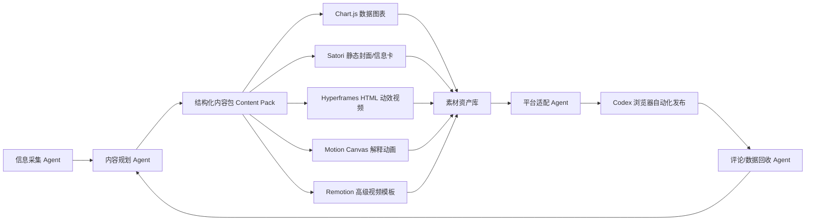
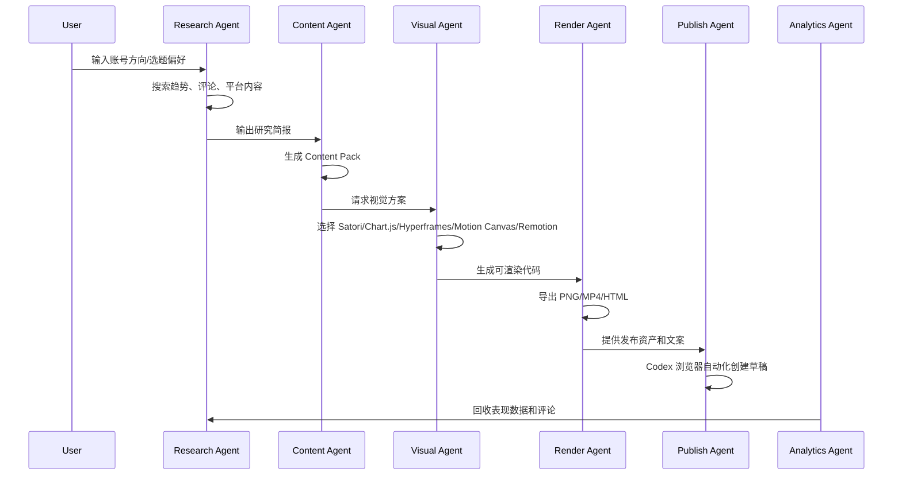

# 五类视觉生成引擎并入 Agent Studio 的产品能力方案

## 目标

将 Hyperframes、Motion Canvas、Chart.js、Satori、Remotion 五类开源能力纳入 Agent Studio 的长期产品架构，使产品从“文本内容生成工具”升级为“Agent 驱动的多平台内容生产系统”。

核心目标：

1. 让 Agent 能够自动完成从选题、研究、脚本、视觉结构、图文、视频到发布草稿的完整链路。
2. 让内容产物从纯文字升级为封面图、信息图、动态图文、HTML 动效视频、解释型动画和高级品牌视频。
3. 让产品具备商业化可交付能力，而不是只停留在 demo 或 prompt 工具。
4. 保留 Codex App 浏览器自动化作为最终网页端发布和维护的关键执行能力。

## 总体架构



## 一、Hyperframes

### 定位

Hyperframes 是面向 Agent 的 HTML 转视频引擎。它允许 Agent 通过 HTML、CSS、JavaScript、GSAP、Lottie、Three.js 等技术生成动态视频，再通过浏览器渲染和 FFmpeg 导出 MP4。

### 并入产品后的角色

Hyperframes 应作为 Agent Studio 的默认视频生成引擎。

适合生成：

- 小红书 9:16 动态卡片视频
- 抖音/视频号短知识视频
- 面试技巧动态讲解
- 简历避坑动态图文
- 数据趋势短视频
- 职场观点类社媒视频
- 多平台竖屏内容模板

### 为什么适合本产品

Agent 最擅长生成结构化文本和 HTML。相比直接生成 AI 视频，HTML 动效视频更稳定、可控、便宜，并且容易批量生产。

AI 视频适合生成真实场景、人物、镜头感强的内容，但对于求职、简历、面试、知识分享类内容，HTML 动效视频更适合作为默认路线。

### 产品功能设计

应新增能力：

1. Motion HTML 生成
2. HTML 动效预览
3. 竖屏 MP4 导出
4. 平台尺寸适配
5. 模板库
6. 字幕/标题动画
7. 数据卡片动画
8. 封面帧导出
9. 渲染失败自动修复
10. Agent 自动选择模板

### 输入结构

```json
{
  "topic": "面试中如何回答离职原因",
  "platform": "xiaohongshu",
  "format": "short_video",
  "ratio": "9:16",
  "duration": 18,
  "hook": "离职原因答错，面试直接凉一半",
  "sections": [
    {
      "title": "不要说前公司坏话",
      "body": "这会让面试官担心你的稳定性和合作方式"
    },
    {
      "title": "转成发展诉求",
      "body": "强调你希望承担更匹配的新职责"
    },
    {
      "title": "给出正向结尾",
      "body": "把离职原因落到成长、匹配和长期目标"
    }
  ],
  "visualStyle": "sharp-editorial",
  "cta": "收藏，下次面试前看一遍"
}
```

### 输出结果

```json
{
  "type": "motion_video",
  "engine": "hyperframes",
  "htmlPath": "server/exports/motion/interview-leave-reason.html",
  "previewUrl": "/exports/motion/interview-leave-reason.html",
  "videoPath": "server/exports/videos/interview-leave-reason.mp4",
  "coverPath": "server/exports/covers/interview-leave-reason.png",
  "duration": 18,
  "ratio": "9:16"
}
```

### 推荐模板类型

- 三段式知识卡
- 错误回答 vs 优秀回答
- 时间线展开
- 热度排行榜
- 简历拆解
- 岗位匹配雷达图
- 评论转选题
- 今日求职避坑
- 案例复盘
- 数据洞察卡

### 商业化价值

Hyperframes 可以成为产品最核心的差异点。它能让 Agent Studio 输出真正可发布的动态内容，而不是普通文案。

第一阶段应优先落地。

## 二、Motion Canvas

### 定位

Motion Canvas 是用 TypeScript 和 Canvas 创建解释型动画的工具。它适合做教学、讲解、逻辑推演、流程拆解类视频。

### 并入产品后的角色

Motion Canvas 应作为高级解释动画引擎，而不是默认视频引擎。

适合生成：

- 面试题拆解动画
- 简历结构分析动画
- 职业路径推演
- 求职流程图
- 薪资谈判逻辑图
- STAR 法则讲解
- 行为面试案例动画
- Offer 对比分析视频

### 为什么适合本产品

求职类内容有大量“解释复杂概念”的场景。Motion Canvas 比普通 HTML 更适合表达流程、层级、关系、因果和推导过程。

例如：

- 为什么简历没有面试邀约
- 面试官到底在听什么
- STAR 回答法如何组织
- 为什么岗位 JD 要反向拆解
- 如何判断一个 offer 是否值得去

这些内容用 Motion Canvas 做动画，会比静态图文更高级。

### 产品功能设计

应新增能力：

1. Explain Animation 模式
2. 动画脚本生成
3. Motion Canvas 模板库
4. 逻辑图节点生成
5. 时间线动画生成
6. Canvas 预览
7. MP4 导出
8. Agent 自动校验动画脚本
9. 动画复杂度评分
10. 教学类内容专用模板

### 输入结构

```json
{
  "topic": "STAR 法则怎么讲项目经历",
  "format": "explain_animation",
  "duration": 30,
  "concepts": [
    {
      "name": "Situation",
      "description": "项目背景"
    },
    {
      "name": "Task",
      "description": "你的目标和责任"
    },
    {
      "name": "Action",
      "description": "你采取的关键行动"
    },
    {
      "name": "Result",
      "description": "最终结果和量化影响"
    }
  ],
  "animationStyle": "clean-technical",
  "platform": "bilibili"
}
```

### 输出结果

```json
{
  "type": "explain_animation",
  "engine": "motion-canvas",
  "sourcePath": "server/exports/motion-canvas/star-method.tsx",
  "previewUrl": "/exports/motion-canvas/star-method.html",
  "videoPath": "server/exports/videos/star-method.mp4"
}
```

### 推荐模板类型

- 概念拆解
- 流程图动画
- 对比分析
- 案例复盘
- 因果链路
- 矩阵分析
- 时间线讲解
- 白板推演
- 节点展开
- 决策树

### 商业化价值

Motion Canvas 能提高产品天花板，尤其适合做高质量课程片段、知识视频和解释动画。

但它的工程复杂度高于 Hyperframes，不建议第一阶段作为默认引擎。

## 三、Chart.js

### 定位

Chart.js 是成熟的 Canvas 图表库，适合快速生成柱状图、折线图、饼图、雷达图、气泡图等可视化内容。

### 并入产品后的角色

Chart.js 应作为 Agent Studio 默认的数据可视化组件。

适合生成：

- 岗位热度趋势
- 面试题类型分布
- 简历问题占比
- 评论情绪分布
- 内容表现复盘
- 账号增长趋势
- 平台互动数据对比
- 求职阶段漏斗
- 技能匹配雷达图
- 选题热度评分

### 为什么适合本产品

用户已经明确认为纯文字拼凑不够高级。Chart.js 可以让内容有“数据感”和“洞察感”。

即使数据来自 Agent 的研究归纳，也可以通过结构化方式呈现为图表，从而提升内容可信度和视觉质量。

### 产品功能设计

应新增能力：

1. Chart Block
2. 图表模板库
3. 数据自动归一化
4. Agent 生成图表 JSON
5. 图表主题系统
6. 图表转 PNG
7. 图表嵌入 Satori 封面
8. 图表嵌入 Hyperframes 视频
9. 复盘数据 dashboard
10. 选题热度可视化

### 输入结构

```json
{
  "title": "今天求职内容热度",
  "chartType": "bar",
  "labels": ["AI 简历", "金三银四", "大厂面试", "裁员补偿"],
  "values": [92, 78, 71, 65],
  "unit": "热度",
  "insight": "AI 简历相关讨论明显升温，适合作为今日主选题"
}
```

### 输出结果

```json
{
  "type": "chart",
  "engine": "chartjs",
  "chartType": "bar",
  "imagePath": "server/exports/charts/job-search-heat.png",
  "dataPath": "server/exports/charts/job-search-heat.json"
}
```

### 推荐图表类型

- Bar chart：热度排行、问题分布
- Line chart：趋势变化
- Doughnut chart：占比拆解
- Radar chart：能力匹配
- Bubble chart：选题机会矩阵
- Funnel chart：求职转化漏斗
- Mixed chart：内容表现对比
- Horizontal bar：社媒内容排行

### 商业化价值

Chart.js 是低成本高回报能力。它不仅用于内容生产，也能用于产品内部复盘和数据面板。

第一阶段应优先落地。

## 四、Satori

### 定位

Satori 是 Vercel 开源的 HTML/CSS/JSX 转 SVG 引擎，常用于生成社媒分享图、Open Graph 图片、卡片式封面图。

### 并入产品后的角色

Satori 应作为 Agent Studio 默认的静态视觉图生成引擎。

适合生成：

- 小红书封面图
- 微博长图标题卡
- LinkedIn 图文卡片
- X 分享图
- 知乎头图
- 内容摘要卡
- 信息图卡片
- 观点海报
- 系列栏目封面
- 多平台尺寸变体

### 为什么适合本产品

Satori 特别适合“文字排版型图片”，而求职、面试、简历类内容天然需要清晰标题、重点词、数字、标签、对比结构。

它比普通截图更可控，比 AI 生图更稳定，比手动设计更自动化。

### 产品功能设计

应新增能力：

1. Cover Generator
2. Info Card Generator
3. 多平台尺寸适配
4. 中文字体配置
5. SVG 预览
6. SVG 转 PNG
7. 模板主题系统
8. 批量生成封面变体
9. A/B 标题图生成
10. 与 Chart.js 组合生成数据卡片

### 输入结构

```json
{
  "platform": "xiaohongshu",
  "ratio": "3:4",
  "title": "离职原因别这样说",
  "subtitle": "面试官真正想听的是这 3 点",
  "tags": ["面试技巧", "求职避坑", "简历优化"],
  "keyPoints": [
    "不要抱怨前公司",
    "转成发展诉求",
    "给出正向结尾"
  ],
  "style": "editorial-card"
}
```

### 输出结果

```json
{
  "type": "cover",
  "engine": "satori",
  "svgPath": "server/exports/covers/leave-reason.svg",
  "pngPath": "server/exports/covers/leave-reason.png",
  "variants": [
    {
      "platform": "xiaohongshu",
      "ratio": "3:4",
      "path": "server/exports/covers/leave-reason-xhs.png"
    },
    {
      "platform": "linkedin",
      "ratio": "1.91:1",
      "path": "server/exports/covers/leave-reason-linkedin.png"
    }
  ]
}
```

### 推荐模板类型

- 强标题封面
- 三点式信息卡
- 错误/正确对比卡
- 数据洞察卡
- Quote 卡
- 清单卡
- Checklist 卡
- Case Study 卡
- 评论转观点卡
- 系列栏目封面

### 商业化价值

Satori 应是产品第一阶段必须接入的能力。它可以最快解决“无图、无设计、像文字拼凑”的问题。

## 五、Remotion

### 定位

Remotion 是用 React 生成视频的成熟框架。它适合构建复杂视频模板、批量视频渲染系统、品牌视频和产品演示视频。

### 并入产品后的角色

Remotion 应作为高级视频模板引擎，而不是第一阶段默认引擎。

适合生成：

- 高质量品牌短视频
- SaaS 产品演示视频
- 企业级内容模板
- 自动化课程片头
- 多段组合视频
- 数据报告视频
- 系列化栏目视频
- 模板市场视频
- 用户自定义品牌视频
- 批量内容视频

### 为什么适合本产品

当 Agent Studio 未来商业化后，用户可能需要稳定的品牌模板、团队素材、企业视觉规范和批量视频生产能力。Remotion 的 React 组件体系适合做这种复杂模板系统。

但在早期，它比 Hyperframes 更重，也更依赖工程体系。

### 产品功能设计

应新增能力：

1. React Video Template
2. 品牌视频模板库
3. 批量渲染队列
4. 企业品牌配置
5. 视频组件市场
6. 数据驱动视频
7. 多场景时间线
8. 云渲染接口
9. 视频版本管理
10. 模板权限和授权控制

### 输入结构

```json
{
  "templateId": "career-report-video",
  "brand": {
    "primaryColor": "#111827",
    "accentColor": "#2DD4BF",
    "font": "Inter"
  },
  "content": {
    "title": "本周求职趋势报告",
    "sections": [
      {
        "title": "AI 简历热度上升",
        "data": [68, 74, 81, 92]
      },
      {
        "title": "面试题关注度集中在行为面",
        "data": [35, 28, 22, 15]
      }
    ]
  },
  "duration": 45,
  "ratio": "16:9"
}
```

### 输出结果

```json
{
  "type": "react_video",
  "engine": "remotion",
  "compositionId": "career-report-video",
  "sourcePath": "server/exports/remotion/career-report-video",
  "videoPath": "server/exports/videos/career-report-video.mp4",
  "thumbnailPath": "server/exports/covers/career-report-video.png"
}
```

### 推荐模板类型

- 品牌报告视频
- 产品 demo 视频
- 数据周报视频
- 课程片头
- 系列栏目包装
- 多平台广告素材
- 案例研究视频
- 企业知识视频
- 招聘账号内容视频
- 批量短视频模板

### 商业化注意事项

Remotion 的授权需要重点确认。它不是简单的 MIT 开源模式，某些公司或商业场景可能需要商业授权。

因此建议：

1. 第一阶段不作为默认引擎。
2. 企业版或 Pro 版再考虑深度接入。
3. 接入前明确 license、客户使用边界和部署方式。
4. 保留 Hyperframes 作为更轻量、更开放的默认视频路线。

## 五个引擎的产品分工

| 能力 | 默认程度 | 主要产物 | 推荐阶段 |
|---|---|---|---|
| Satori | 默认 | 封面图、信息卡、图文卡片 | 第一阶段 |
| Chart.js | 默认 | 数据图表、趋势图、复盘图 | 第一阶段 |
| Hyperframes | 默认 | HTML 动效视频、竖屏 MP4 | 第一阶段 |
| Motion Canvas | 高级 | 解释动画、教学视频 | 第二阶段 |
| Remotion | 高级 | 品牌视频、企业模板、批量视频 | 第三阶段 |

## 推荐落地顺序

### 第一阶段：可发布内容能力

目标：解决当前产品“文字拼凑、无图、无视频、无设计”的问题。

优先接入：

1. Satori
2. Chart.js
3. Hyperframes

核心功能：

- 生成小红书封面图
- 生成图文信息卡
- 生成动态图文短视频
- 导出 PNG
- 导出 MP4
- 自动生成平台文案
- Codex 浏览器自动化进入发布草稿页

### 第二阶段：高级解释内容能力

目标：让产品可以生成更有内容壁垒的知识视频。

接入：

1. Motion Canvas

核心功能：

- 面试题讲解动画
- 简历拆解动画
- 职业路径推演动画
- 流程图动画
- 课程型短视频

### 第三阶段：企业级视频模板能力

目标：支持商业客户、品牌账号、团队工作流。

接入：

1. Remotion

核心功能：

- 品牌模板
- 团队模板库
- 批量视频渲染
- 多品牌配置
- 视频模板市场
- 云渲染队列

## Agent 工作流设计



## Content Pack 标准

所有视觉引擎都不应该直接吃散乱文本，而应该统一接收 Content Pack。

```json
{
  "id": "content_20260527_001",
  "topic": "面试中如何回答离职原因",
  "platforms": ["xiaohongshu", "douyin", "linkedin"],
  "audience": "正在找工作的职场人",
  "angle": "避坑 + 正确表达",
  "hook": "离职原因答错，面试直接凉一半",
  "claim": "面试官真正关心的不是你为什么走，而是你是否稳定、成熟、匹配。",
  "sections": [
    {
      "title": "不要抱怨前公司",
      "body": "抱怨会让面试官担心你的合作方式。"
    },
    {
      "title": "转成发展诉求",
      "body": "把原因表达为职责匹配度、成长空间和长期规划。"
    },
    {
      "title": "给出正向结尾",
      "body": "强调你认可过往经历，也清楚下一步目标。"
    }
  ],
  "data": {
    "chartType": "bar",
    "labels": ["抱怨前公司", "说薪资太低", "说想成长", "说岗位更匹配"],
    "values": [32, 28, 74, 86]
  },
  "visual": {
    "style": "editorial-career",
    "colorMode": "clean-contrast",
    "ratio": "9:16"
  },
  "copy": {
    "xiaohongshu": {
      "title": "离职原因别这样说",
      "body": "面试里，离职原因不是情绪题，而是成熟度测试。"
    },
    "linkedin": {
      "title": "How to Explain Why You Left Your Last Job",
      "body": "A strong answer reframes the reason into growth, fit, and long-term direction."
    }
  },
  "cta": "收藏，下次面试前看一遍"
}
```

## 渲染引擎选择规则

Agent 应根据内容类型自动选择引擎。

```json
{
  "rules": [
    {
      "condition": "需要封面图、信息卡、静态图文",
      "engine": "satori"
    },
    {
      "condition": "需要数据图表",
      "engine": "chartjs"
    },
    {
      "condition": "需要普通短视频、动态图文、竖屏 MP4",
      "engine": "hyperframes"
    },
    {
      "condition": "需要复杂概念解释、流程动画、教学动画",
      "engine": "motion-canvas"
    },
    {
      "condition": "需要品牌视频、企业模板、批量视频",
      "engine": "remotion"
    }
  ]
}
```

## 平台适配策略

### 小红书

推荐产物：

- Satori 封面图
- Satori 图文卡片
- Hyperframes 竖屏视频
- Chart.js 数据卡

推荐比例：

- 3:4
- 4:5
- 9:16

### 抖音 / 视频号

推荐产物：

- Hyperframes 竖屏短视频
- Motion Canvas 讲解动画
- Remotion 高级视频

推荐比例：

- 9:16

### X / LinkedIn

推荐产物：

- Satori 分享图
- Chart.js 数据图
- Remotion 横屏短视频

推荐比例：

- 1.91:1
- 16:9
- 1:1

### 微博 / 知乎

推荐产物：

- Satori 信息长图
- Chart.js 数据图
- Hyperframes 摘要视频

推荐比例：

- 3:4
- 1:1
- 16:9

## 产品界面建议

应将当前产品中的素材区升级为 Visual Studio。

推荐模块：

1. Cover
2. Info Card
3. Chart
4. Motion Video
5. Explain Animation
6. Brand Video

每个模块都应该包含：

- 输入内容
- 引擎选择
- 模板选择
- 平台尺寸
- 预览
- 导出
- 加入发布包
- 重新生成
- 版本历史

## API 设计建议

### 生成封面

```http
POST /api/assets/cover
```

使用 Satori。

### 生成信息图

```http
POST /api/assets/info-card
```

使用 Satori + Chart.js。

### 生成图表

```http
POST /api/assets/chart
```

使用 Chart.js。

### 生成 HTML 动效视频

```http
POST /api/assets/motion-html
```

使用 Hyperframes。

### 导出 MP4

```http
POST /api/assets/export-video
```

使用 Hyperframes / Motion Canvas / Remotion。

### 生成解释动画

```http
POST /api/assets/explain-animation
```

使用 Motion Canvas。

### 生成高级视频

```http
POST /api/assets/react-video
```

使用 Remotion。

## 商业化版本设计

### Free / Local

包含：

- 本地内容生成
- Satori 基础封面
- Chart.js 基础图表
- HTML 预览
- 手动导出

### Pro

包含：

- Hyperframes 视频导出
- 多平台尺寸
- 模板库
- Codex 浏览器发布助手
- 内容日历
- 评论维护
- 数据复盘

### Team

包含：

- 团队品牌模板
- 多账号管理
- 审核流
- 素材库
- 角色权限
- 批量生成
- 定时内容计划

### Enterprise

包含：

- Remotion 高级视频模板
- 私有部署
- 专属模板
- 品牌规范系统
- 自定义 Agent 工作流
- 数据仓库接入
- 合规审计

## 技术风险

### Hyperframes

风险：

- 新项目，生态还在变化。
- 依赖 FFmpeg 和浏览器渲染。
- 复杂动画可能渲染不稳定。

应对：

- 从固定模板开始。
- 加入渲染预检。
- 失败后自动降级为 PNG 或 HTML。

### Motion Canvas

风险：

- Agent 直接生成代码有一定失败率。
- 学习成本较高。

应对：

- 不让 Agent 从零写复杂动画。
- 使用模板参数化生成。
- 加入代码校验和预览截图。

### Chart.js

风险：

- 默认视觉普通。
- 数据真实性需要标注来源。

应对：

- 自定义主题。
- 内容包中保留 sources。
- 图表标注“趋势归纳”或“样本观察”。

### Satori

风险：

- CSS 支持有限。
- 中文字体要配置。
- 复杂布局不如真实浏览器。

应对：

- 控制模板复杂度。
- 内置中文字体。
- 输出前截图校验。

### Remotion

风险：

- 授权需要确认。
- 工程复杂度较高。
- 渲染成本高于 HTML 静态图。

应对：

- 放到后期企业版。
- 明确商业授权。
- 不作为 MVP 默认依赖。

## 推荐最终结论

Agent Studio 应采用分层视觉生成架构。

第一阶段：

- Satori 负责封面图和静态信息卡。
- Chart.js 负责数据图表。
- Hyperframes 负责 HTML 动效视频和 MP4 导出。

第二阶段：

- Motion Canvas 负责高级解释动画。

第三阶段：

- Remotion 负责企业级品牌视频和模板市场。

这条路线能最大化利用 Codex/Agent 的优势，因为 Agent 最稳定的产物是结构化文本、HTML、JSX、JSON 和代码。相比直接依赖 AI 视频模型，HTML/代码驱动的视频生产更稳定、更便宜、更可控，也更适合商业化。
